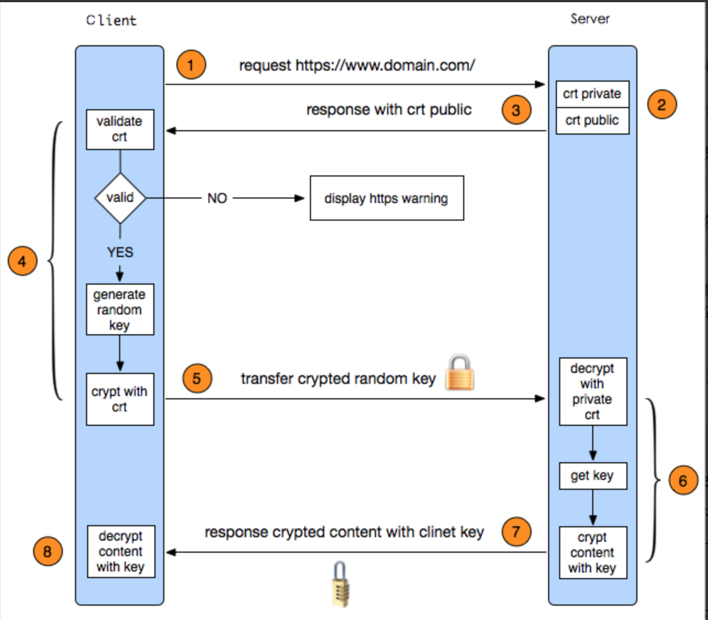

# https原理

##为什么要使用https代替已有的http？

1.http是明文传输的，内容容易被监听，窃听风险
2.不验证通信方的身份，可以伪装身份，冒充风险
3.无法证明报文的完整性，可能被篡改，篡改风险
开发中的现象**运营商的劫持** 

##https特点

http是https的安全升级版本，在http的基础上添加了SSL/TLS层。基本原理：基本思路就是采用公钥加密，客户端向服务端索要公钥，收到公钥后使用它加密信息，服务器收到信息后使用与公钥配套的私钥解密!

###1、客户端发起https请求

###2、服务端的配置

采用https协议的服务器必须要有一套数字证书，可以自己制作，也可以向组织申请。区别就是自己颁发的证书需要客户端验证通过，才可以继续访问，而使用受信用的公司申请的证书则不会弹出提示

###传送证书

这个证书就是公钥，只是包含了很多信息，如证书的颁发机构，过期时间等。

###客户端解析证书

客户端TLS来完成的，首先会验证公钥是否有效，比如颁发机构，过期时间等，如果发现异常，则会弹出一个警告框，提示证书存在问题。如果证书没有问题，那么就生成一个随机值，然后用证书对该随机值进行加密。

###传送加密信息

这部分传送的是证书加密后的随机值，目的就是让服务端得到这个随机值，以后客户端和服务端的通信就可以通过这个随机值来进行加密和解密了。

###服务端解密信息

服务端用私钥解密后，得到了客户端传过来的随机值(私钥)，然后把内容通过该值进行**对称加密**。所谓对称加密就是，将信息和私钥通过某种算法混合在一起，这样除非知道私钥，不然无法获取内容，而正好客户端和服务端都知道这个私钥，所以只要加密算法够好，私钥够复杂，数据就安全。

###传输加密后的信息

这部分信息是服务端用私钥加密后的信息，可以在客户端被还原。

###客户端解密信息

客户端用之前的私钥(随机数)解密服务端传过来的信息，于是获取了解密后的内容。整个过程第三方即使监听到了数据，也束手无策。

##对称加密

加密和解密使用相同的秘钥，或是使用两个可以简单的相互推算的秘钥。实务上，这组秘钥成为在两个或多个成员间的公同秘钥，以便维持专属的通讯联系。(DES,3DES,AES)

##非对称加密

公开秘钥加密，也称为非对称加密，一种密码学算法类型，在这种密码学方法中，需要一对秘钥，一个是私人秘钥，一个是公开秘钥。这两个秘钥是数学相关，用某用户加密后得到的信息，只能用该用户的解密秘钥才能解密。