# git

#git 基础要点

#安装 git
#初次运行git前的配置
# git基础
## 检查当前文件状态
要确认哪些文件当前处于什么状态，可以用 git status命令。

```
 $git status
```
## 跟踪新文件
```
 $ git add README
```
此时再运行 git status 命令，会看到文件被跟踪了，并处于暂存状态。
```
$ git status
# On branch master
# Changes to be committed:
# (use "git reset HEAD <file>..." to unstage) #
# new file: README #
```
只要在 "Change to be committed" 这行下面的，就说明是已经暂存状态。如果此时提交，那该文件此时此刻的版本将被留在历史记录中，

##暂存已修改文件
现在我们修改下之前已跟踪的文件，再次运行status命令，会看到这样的状态报告：
```
$ git status
# On branch master
# Changes to be committed:
# (use "git #
# new file: #
# Changed but
# (use "git #
# modified:
#
reset HEAD <file>..." to unstage) README
not updated:
add <file>..." to update what will be committed)
benchmarks.rb
```
文件出现在 "Changed but not updated" 这行下面，说明已跟踪文件的内容发生了编码，但还没有放到暂存区。要暂存这次更新，需要运行 git add 命令。
```
$ git add benchmarks.rb
$ git status
# On branch master
# Changes to be committed:
# (use "git reset HEAD <file>..." to unstage) #
# new file: README
# modified: benchmarks.rb
```
现在两个文件都已经暂存，下次提交时就会一并记录到仓库。假设此时，你想要在文件里面添加条注释，重新编辑存盘后，准备好提交。不过且慢，在运行 git status 看看:
```
$ vim benchmarks.rb
$ git status
# On branch master
# Changes to be committed:
# (use "git #
# new file:
# modified:
#
# Changed but
# (use "git #
# modified: #
```
见鬼，benchmarks.rb 文件出现了两次，一次算未暂存，一次已暂存，这怎么可能。实际上
git 只不过暂存了你运行 git add 命令的版本，如果现在提交，那么提交的是添加注释前的版本，而非当前工作目录中的版本，所以，运行了git add 之后又做了修改的文件，需要重新运行 git add 把最新版本重新暂存起来。
```
$ git add benchmarks.rb
$ git status
# On branch master
# Changes to be committed:
# (use "git reset HEAD <file>..." to unstage) #
# new file: README
# modified: benchmarks.rb #
```
## 忽略某些文件
一般我们总会有些文件无需要纳入git 的管理，也不需要他们总出现在未跟踪的文件列表，通常都是些自动生成的文件，像是日志或者编译过程中的创建的等等，我们可以创建一个名为.gitignore的文件，列出需要忽略的文件模式，来看一个简单的例子:

```
$ cat .gitignore *.[oa]
*~
```
第一行是告诉git 忽略所有以.o 或者.a结尾的文件，

```
# 此为注释 – 将被 Git 忽略
*.a # 忽略所有 .a 结尾的文件
!lib.a # 但 lib.a 除外
/TODO # 仅仅忽略项目根目录下的 TODO 文件，不包括 subdir/TODO build/ # 忽略 build/ 目录下的所有文件
doc/*.txt # 会忽略 doc/notes.txt 但不包括 doc/server/arch.txt
```
## git查看已暂存和未暂存的更新
git diff 可以查看到当前哪些更新还没有暂存，有哪些更新已经暂存起来准备好了下次提交，git diff 会使用文件补丁的格式显示具体添加和删除的行。
假如再次修改 README 文件后暂存，然后编辑 benchmarks.rb 文件后先别暂存，运行 status 命令，会看到:
```
diff --git a/docs/15344337995634.md b/docs/15344337995634.md
index bed0f1b..7802ea8 100644
--- a/docs/15344337995634.md
+++ b/docs/15344337995634.md
@@ -1 +1,3 @@
-# iOS 逆向工程
\ No newline at end of file
+# iOS 逆向工程
+## 逆向工具详解
+                         
\ No newline at end of file
diff --git a/docs/15346793530714.md b/docs/15346793530714.md
index 7451b1a..83eff50 100644
--- a/docs/15346793530714.md
+++ b/docs/15346793530714.md
@@ -5,6 +5,103 @@
 #安装 git
 #初次运行git前的配置
 # git基础
+## 检查当前文件状态
+要确认哪些文件当前处于什么状态，可以用 git status命令。
```
```
git diff : 查看尚未暂存的文件更新了哪些部分，不加参数直接输入 git diff
git diff --cached :若要看已经暂存起来的文件和上次提交的时候快照之间的差异，
```
##移除文件
要从git 中移除某个文件，就必须要从已跟踪文件清单中移除(确切的说，是从暂存区域移除)，然后提交，可以用 git rm 命令完成此项工作，并连带从工作目录中删除指定的文件，这样以后就不会出现在未跟踪文件清单中。
```
$git rm grit.gemspec
```
另外一种情况是，我们想把文件从Git 仓库中删除(从暂存区域移除)，但任然希望保留在当前工作目录中。换句话说，仅是从跟踪清单中删除
```
$git rm --cached readme.txt
```
##移动文件
git 修改某个文件名
```
$git mv file_from file_to
```
其实运行 git mv 就相当于运行了下面三条命令
```
$ mv file_from file_from
$ git rm file_from
$ git add file_from
```
## 撤销操作
有些操作并不总是可以撤销的，所以请务必谨慎小心，一旦失误，就有可能丢失部分工作成果。
### 修改最后一次提交
有时候我们提交完了才发现漏掉了几个文件没有添加，或者提交信息写错了。想要撤销刚才的提交操作，可以使用 --amend 选项重新提交:
```
 $git commit --amend
```
此命令将使用当前的暂存区域快照提交，如果提交完没有做任何改动，直接运行此命令的话，相当于有机会重新编辑提交说明，而所提交的文件快照和之前的一样。
```
$git commit -m 'initial commit'
$git add forgotten_file
$git commit --amend
```
上面三条命令最终得到一个提交，第二个提交命令修正了第一个提交的内容。
### 取消已暂存的文件
git add . 全加到了暂存区域。该如何撤销暂存其中的一个文件呢，
```
 $git add .
 $git status
```
可以使用 git reset HEAD<file>的方式取消暂存，
### 取消对文件的修改
```
Changed but not updated:
(use "git add <file>..." to update what will be committed)
(use "git checkout -- <file>..." to discard changes in working directory)
modified: benchmarks.rb
```
##远程仓库的使用
### 查看当前的远程库
```
 $git remote
```
### 添加远程仓库
 要添加一个新的远程仓库，可以指定一个简单的名字，以便将来引用，运行 git remote add [shortname] [url]:
```
 $git remote
 origin
 $git remote add pb git://github.com/paulboone/ticgit.git
 $git remote -v
```
现在可以用字符串pb 指定对应的仓库地址值，比如说，要抓取所有Paul有的，但本地仓库么有的信息，可以运行 git fetch pb:
```
 $git fetch pb
```
现在，Paul的主干分支(master)已经完全可以在本地访问了
### 从远程仓库抓取数据
正如之前所看到的，可以用下面的命令从远程仓库抓取数据到本地:
```
 $git fetch [remote-name]
```
此命令会到远程仓库中拉去所有你本地仓库中还没有的数据，运行此命令后，你就可以在本地访问该远程仓库中的所有分支，将其中某个分支合并到本地，或者只是取出某个分支，一探究竟。
如果是克隆了一个仓库，此命令会自动将远程仓库归于 origin 名下，所以，git fetch origin 会抓取从你上次克隆以来别人上传到此远程仓库中的所有更新(或是上次fetch 以来别人提交的更新)。有一点很重要，fetch 命令只是将远程数据拉到本地仓库，并不自动合并到当前的工作分支，只有当你确实准备好了，才能手动合并。
### 推送数据到远程仓库
```
 git push origin master
```
### 查看远程仓库信息
我们可以通过命令 git remote show [remote-name]查看某个远程仓库的详细信息，比如要看仓库所克隆的 origin仓库，可以运行：
```
 $git remote show origin
```

### 远程仓库的删除和重命名
可以使用 git remote rename 命令修改某个远程仓库的简短名称，比如想把 pb 改成paul 
``` 
 $git remote rename pb paul
 $git remote
```
删除远端仓库
```
$git remote rm paul
$git remote  //查看远端的服务器
```

##打标签
### 列出已有的标签
```
 $ git tag
```
### 轻量标签


##小技巧和窍门
#git分支
##git存储数据，git保存的不是文件差异或者变化量，而只是一系列文件快照。在git中提交时，会保存一个commit对象，它包含了一个指向暂存内容快照的指针，作者和相关附属信息，以及一定数量指向该提交对象直接祖先的指针：第一次提交是没有直接祖先的，普通提交有一个祖先，由两个或多个分支合并产生的提交则有多个祖先。
### 为直观起见，我们假设在工作目录中有三个文件，准备将他们暂存后提交，暂存操作会对每一个文件计算校验和（SHA-1 哈希字符串），然后把当前版本的文件快照保存到git 仓库中，并将校验和加入暂存区域:
```
$ git add README test.rb LICENSE2
$ git commit -m 'initial commit of my project'
```
当使用git commit 新建一个提交对象前，Git会先计算每一个子目录的校验和，然后在git仓库中将这些目录保存为树对象，之后Git创建的对象提交对象，除了包含先关提交信息以外，还包含指向这个树对象的指针，如此它就可以在将来需要的时候，重现此快照的内容。
现在，git 仓库中有5个对象，三个表示文件快照内容的blob对象，一个记录着目录树内容及其中每个文件对应blob对象索引的tree对象；以及一个包含指向tree对象；以及一个包含指向tree对象(根目录)的索引和其他提交信息元数据的commit对象，概念上说，仓库中的每个对象保存的数据和相互关系看起来如图所示
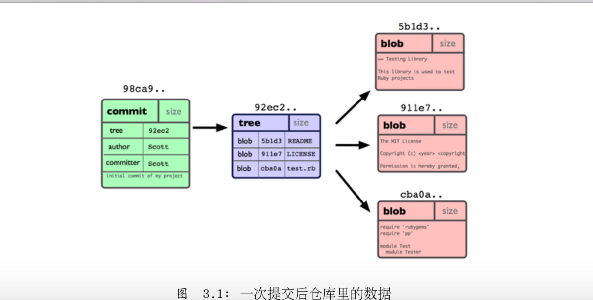
做些修改后再次提交，这次提交对象会包含一个指向上次提交对象的指针，两次提交后，仓库历史会变成下面的样式。
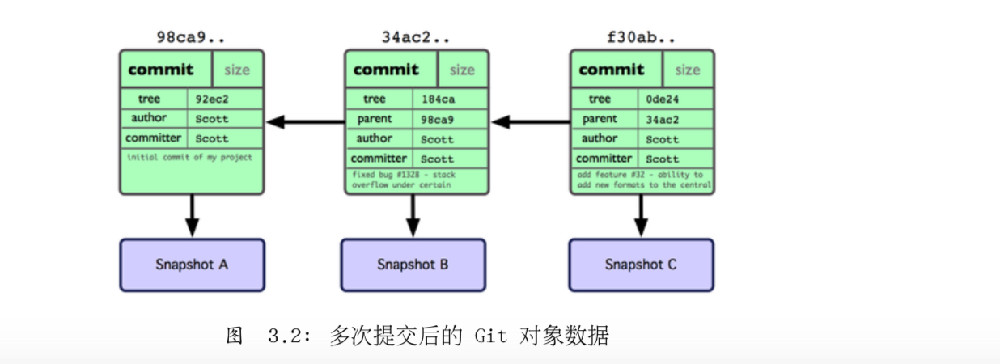

git分支，其实本质上仅仅是个指向commit对象的可变指针，Git会使用master作为分支的默认名字，在若干次提交后，其实已经有了一个指向最后一次提交对象的master分支，在每次提交的时候都会自动向前移动。

那么，Git又是如何创建一个新的分支的呢，创建一个新的分支指针，比如创建一个testing分支，可以使用git branch命令:
```
 $git branch testing
```
这会在当前commit对象上新建一个分支指针
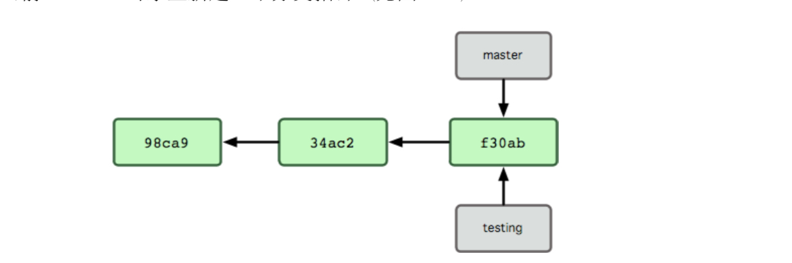
那么git是如何知道你当前在哪个分支上工作的呢。它保存着一个名为HEAD的特别指针，在git中，它是一个指向你正在工作中的本地分支的指针。运行git branch命令，仅仅是建立了一个新的分支，但不会自动切换到这个分支中去。
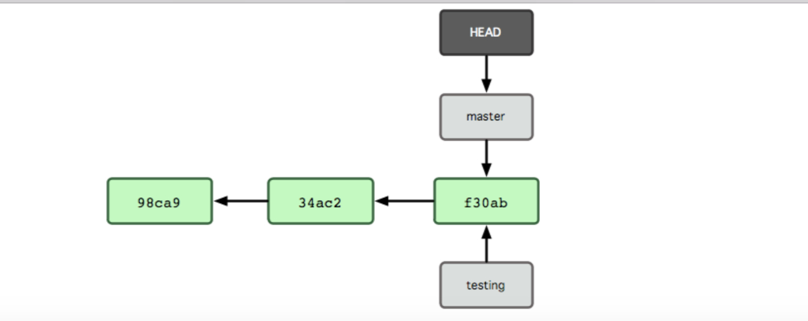
如果切换到其他分支，可以执行git checkout命令，我们现在转换到新建的testing 分支：
```
 $git checkout testing
```
这样HEAD就指向了testing分支
这样的实现方式会给我们带来什么好处呢
```
 $vim test.rb
 $git commit -a -m 'made a change'
```
非常有趣，现在testing分支向前移动了一格，而master 分支仍然指向原先git checkout 时所在的commit对象。
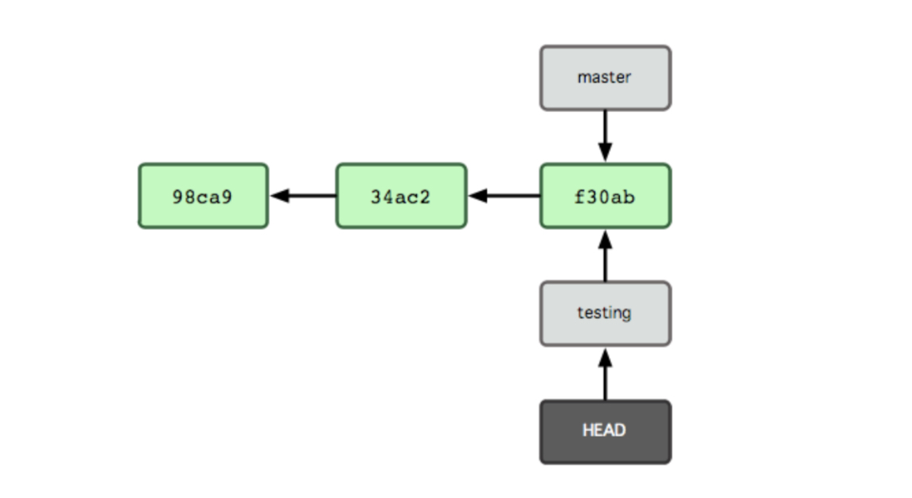


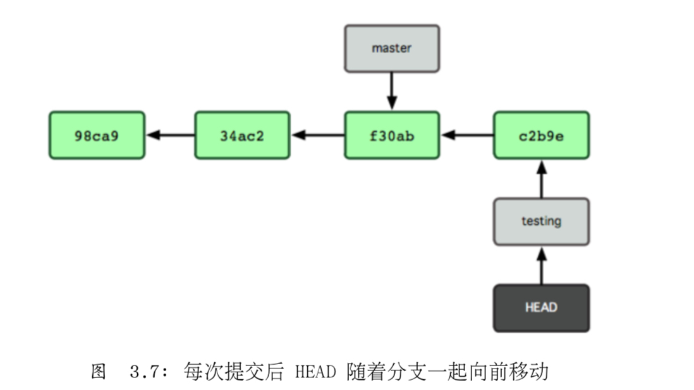

```
$git checkout master  
```
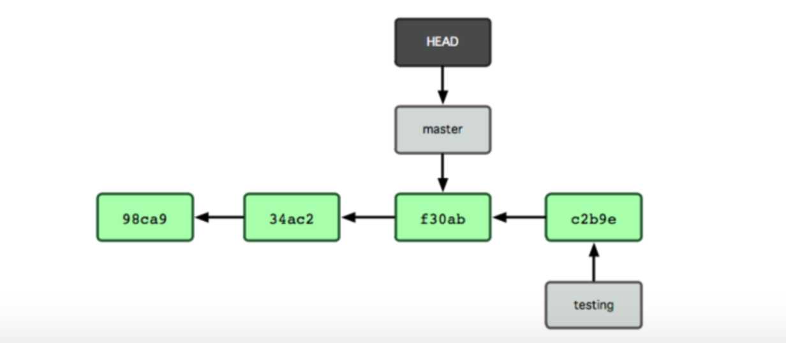
HEAD 在一次checkout之后移动到了另外一个分支。
这条命令做了两件事，它把HEAD指针移回到master分支，并把工作目录中的文件换成了master分支所指向的快照内容。也就是说，现在开始所做的改动，将始于本项目中一个老的版本，它的主要作用是将testing分支里作出的修改暂时取消，这样你就可以向另一个方向进行开发。
我们再次修改
```
 $vim test.rb
 $git commit -a -m 'made other changes'
```
现在我们的项目提交历史产生了分叉，因为刚才我们创建了一个分支，转换到其中进行了一些工作，然后又回到原来的主分支进行了另外的一些工作，这些改变分别孤立在不同的分支里，我们可以在不同分支里反复切换，并在时机成熟时把他们合并到一起，而所有这些工作，仅仅需要branch 和 checkout 这两条命令就可以完成。
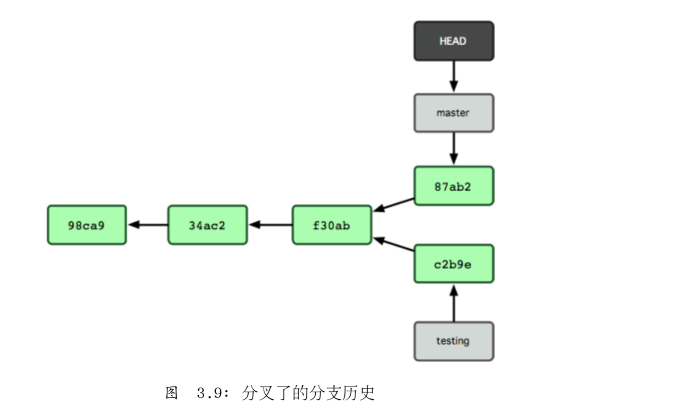


由于git中的分支实际上仅是一个包含所指对象的校验和的文件，所以创建和销毁一个分支就变的非常廉价，新建一个分支就是指向一个文件那么简单，当然也就很快。
## 基本的分支与合并
### 基本分支 
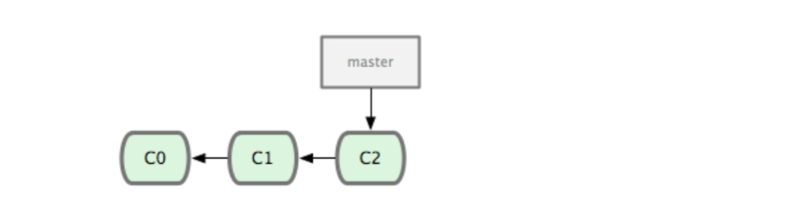
现在，你决定要修补问题追踪系统上的问题，Git并不同任何特定的问题追踪系统打交道，把新建的分支取名为iss53 要新建并切换到改分支，运行 git checkout 并加上 -b 参数。
```
$git checkout -b iss53
```
相当与下面两条命令:
```
$git branch iss53
$git check iss53
```
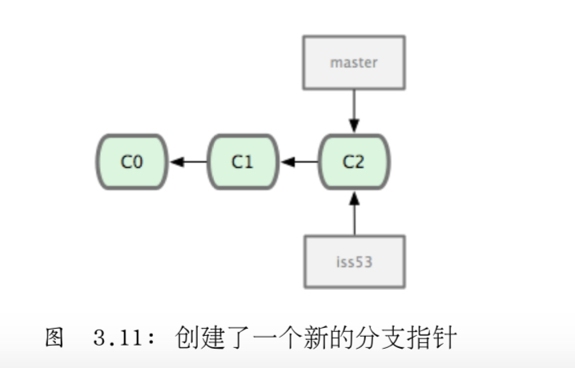
接下来，你在网站项目上继续工作并做了一次提交，这会使iss53分支的指针随着提交向前推荐，因为它处于检出状态(或者说，你的HEAD指针目前正指向它)
```
 $vim index.html
 $git commit -a -m 'added a new footer [issue 53]'
```
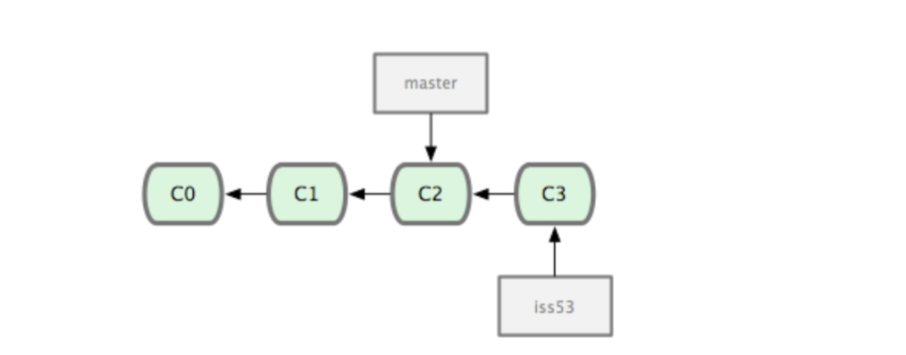

```
 $git checkout master
```

```
 $ git checkout -b 'hotfix'
 $ vim index.html
 $ git commit -a -m 'fixed the broken email address'
```
合并代码，把它合并到master分支后并发布到生产服务器。用git merge命令来进行合并:
```
 $ git checkout master
 $ git merge hotfix
```
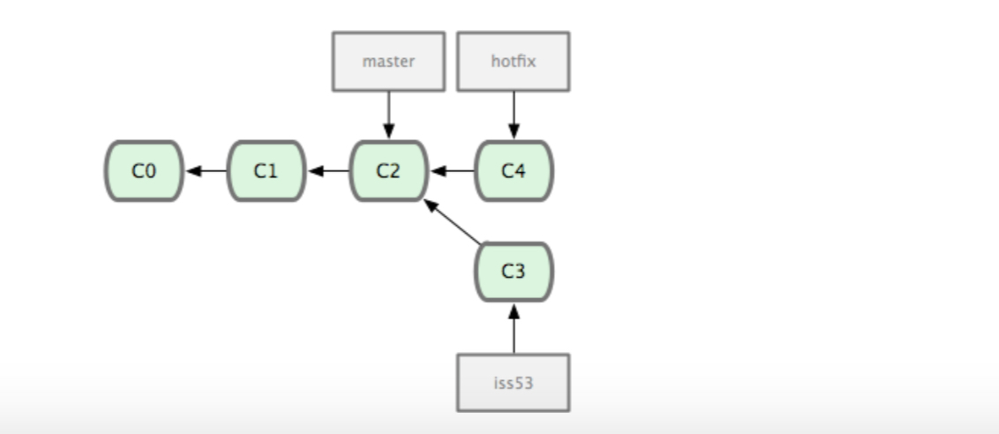
由于当前master 分支所在的commit是要并入到hotfix分支的直接上游，git只需要把指针右移，换句话说，如果顺着一个分支走下去可以到达另一个分支，那么git在合并两者时，只会简单的把指针前移，因为没有什么分歧需要解决，所以这个过程叫做快进。
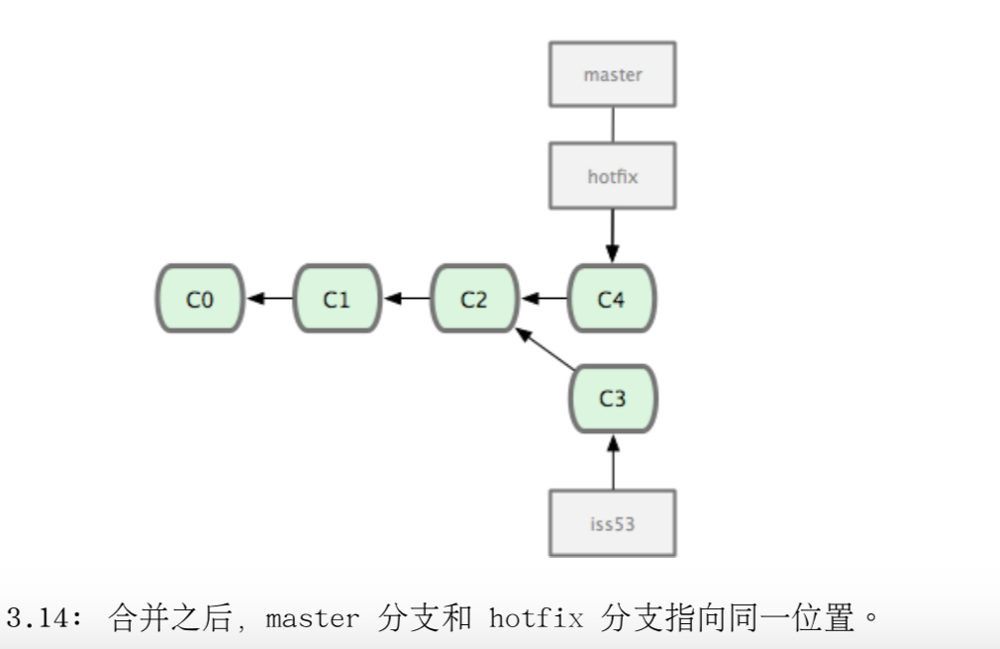
现在hotfix分支和master指向相同的提交，现在也没有什么用了，可以删除他，使用git branch 的-d选项表示删除
```
 $ git branch -d hotfix
```

```
 $ git checkout iss53
 $ vim index.html
 $ git commit -a -m 'finished the new footer [issue 53]'
```
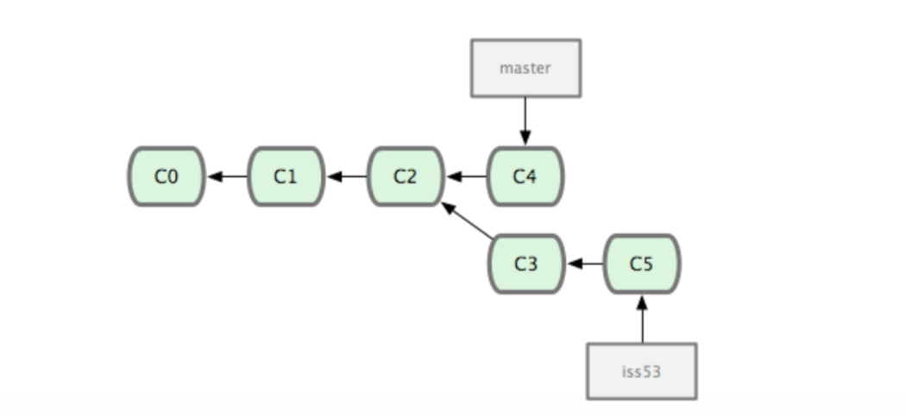

## 基本合并
在问题工作完成之后，可以合并回master分支，实际操作同前面合并hotfix分支差不多，只需检出想要更新的分支(master)，并运行 git merge 命令指定来源：
```
 $git checkout master
 $git merger iss53
```
这次合并的实现，不同之前hotfix的并入方式，这一次，你的开发历史是从更早的地方开始分叉的，由于当前master分支所指向的commit(c4)并非想要并入分支（iss53）的直接祖先，Git不得不进行一些处理，Git会用两个分支的末端(C4和C5)和他们的共同祖先（C2）进行一次简单的三方合并计算。
git没有简单的把分支指向右移，而是对三方合并的结果做了一次新的快照，并自动创建一个执行他的commit(C6)。我们把这个特殊的commit 称做合并提交(merge commit)，因为它的祖先不止一个。
值得一提的是git 可以自己裁决哪个共同祖先才是最佳合并基础，。
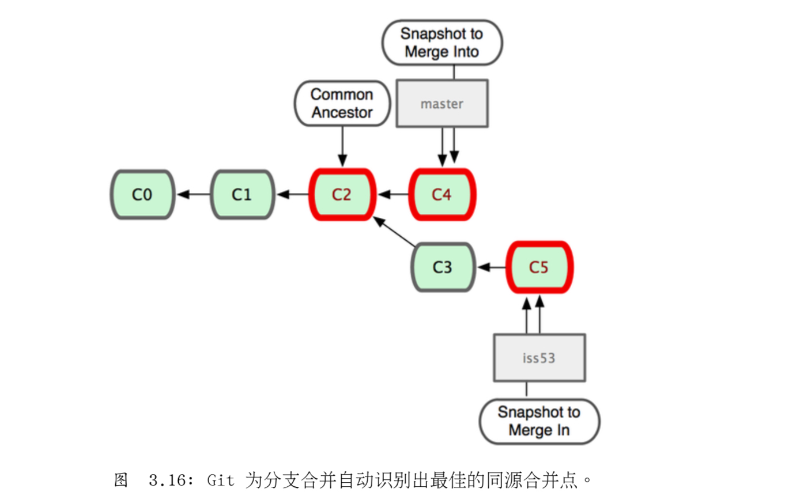
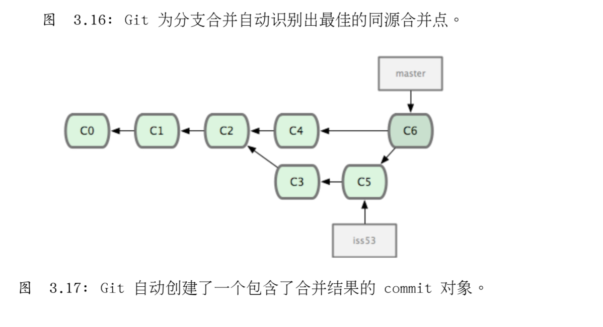

### 冲突的合并
如果你修改了两个待合并分支里同一个文件的同一部分，git就无法干净的把两者合到一起，如果你在解决#53的过程中修改了hotfix中修改的部分，将得到类似下面的结果：
```
 $git merge iss53
```
git 做了合并，但没有提交，它会停下来等你解决冲突，
```
<<<<<<< HEAD:index.html
<div id="footer">contact : email.support@github.com</div> =======
<div id="footer">
please contact us at support@github.com </div>
>>>>>>> iss53:index.html
```
可以看到 ===== 隔开的上半部分，是HEAD（master分支）中的内容，下半部分是在iss53分支中的内容，
#服务器上的git
#分布式git
#git的工具
#自定义git
#git 内部原理
## 底层命令和高层命令
当你在一个新目录或已有的目录内执行git init时，Git会创建一个.git目录，几乎所有Git存储和操作的内容都位于该目录下，如果你要备份或复制一个库，基本上将这一目录拷贝到该目录下。如果你要备份或负责一个库，基本上将这一目录拷贝到其他地方就可以了。该目录结构如下:
```
$ls
HEAD
branches/
config
description
hooks/
index
info/
objects/
refs/
```
该目录下有可能还有其他文件，但这是一个全新的 git init生成的库，所以默认情况下这些就是你能看到的结构。config文件包含了项目忒有的配置选项，info目录保存了一份不希望在.gitignore文件中管理的忽略模式的全局可执行。objects和refs目录。这些是git的核心部分，objects目录存储所有数据内容，refs目录存储执向数据(分支)的提交对象的指针，HEAD文件指向当前分支，index文件保存了暂存区域信息。

##git 对象
git 是一套内容寻址文件系统，git是简单的key-value数据存储。它允许插入任意类型的内容，并会返回一个键值，通过该键值可以在任何时候在取出该内容。内容通过底层命令hash-object 来示范这点，传一些数据给该命令，它会将数据保存在.git目录并返回表示这些数据的键值。
```
$ mkdir test
$ cd test
$ git init
$ find .git/ojbects
$ find .git/objects -type f
```
Git 初始化了objects 目录，同时在该目录下创建了pack和info子目录，但是该目录下没有其他常规的文件。我们往这个git数据库里存储一些文本。
```
echo 'test content'|git hash-object -w --stdin
6ea2d9105feab4280a29f2d5c3f06450a68043f9
```
参数-w指示hash-object命令存储对象，若不指定这个参数命令仅仅返回键值。--stdin指定从标准输入设置来读取内容，若不指定这个参数则需指定一个要存储的文件的路径。
```
$find .git/objects -type f
```
可以在objects 目录下看懂一个文件，这便是git存储数据内容的方式，为每份内容生成一个文件，取的该内容与头部信息的SHA-1校验和，创建以该校验和前两个字符为名称的子目录，并以(校验和)剩下38个字符为文件命名（保存到子目录下）。
通过 cat-file命令可以将数据内容取回、该命令是查看git对象的瑞士军刀。
```
git cat-file -p d670460b4b4aece5915caf5c68d12f560a9fe3e4
```
可以往git中添加更多内容并取回。也可以直接添加文件。
```
nandeMBP:gitTest tuhaisheng$ echo 'version 1' > test.txt
nandeMBP:gitTest tuhaisheng$ git hash-object -w test.txt
83baae61804e65cc73a7201a7252750c76066a30
nandeMBP:gitTest tuhaisheng$ echo 'version 2' > test.txt
nandeMBP:gitTest tuhaisheng$ git hash-object -w test.txt
1f7a7a472abf3dd9643fd615f6da379c4acb3e3a
nandeMBP:gitTest tuhaisheng$ 
```
数据库中已经将文件的两个新版本连同一开始的内容保存下来:
```
nandeMBP:gitTest tuhaisheng$ find .git/objects -type f
.git/objects/d6/70460b4b4aece5915caf5c68d12f560a9fe3e4
.git/objects/1f/7a7a472abf3dd9643fd615f6da379c4acb3e3a
.git/objects/6e/a2d9105feab4280a29f2d5c3f06450a68043f9
.git/objects/83/baae61804e65cc73a7201a7252750c76066a30
```
存储的并不是文件名而仅仅是文件内容。这种对象类型为blob。通过传递SHA-1 值给cat-file-t 命令可以让git 返回任何对象的类型

