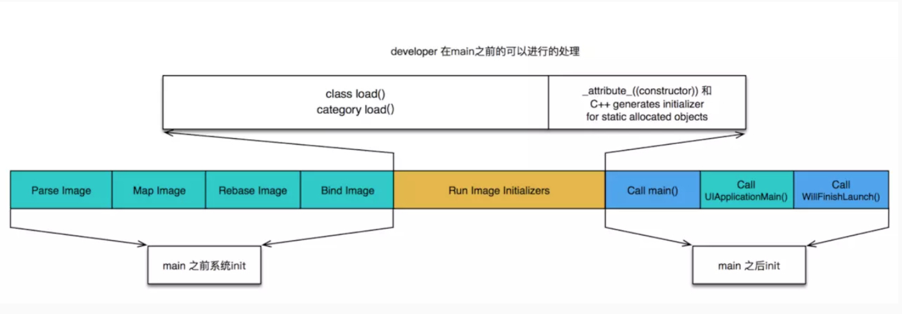

# iOS 性能优化
##流畅度
再YY大神的[iOS保持界面流畅度](https://blog.ibireme.com/2015/11/12/smooth_user_interfaces_for_ios/)的技巧中详细介绍了[CPU资源消耗原因](https://blog.ibireme.com/2015/11/12/smooth_user_interfaces_for_ios/#31)和解决方案[和GPU资源消耗原因和解决方案](https://blog.ibireme.com/2015/11/12/smooth_user_interfaces_for_ios/#32)，这里面包括了大部分的场景，可以帮我们快速定位卡顿的原因，迅速解决卡顿。

###TableViewCell 复用
在cellForRowAtIndexPath:回调的时候只创建实例，快速返回cell，不绑定数据。在willDisplayCell:forRowAtIndexPath:的时候绑定数据
### 高度缓存
在tableView滑动时，会不断调用heightForRowAtIndexPath:,当cell高度需要自适应时，每次回调都要计算高度，会导致UI卡顿，为了避免重复无意义的计算，需要缓存高度，

### 减少透明view
使用透明view会引起blending，在iOS的图形处理中，blending主要指的是混合像素颜色的计算，最直观的例子就是，我们把两个图层叠加在一起，如果第一个图层的透明，则最终像素的颜色计算需要将第二个图层也考虑进来，这一过程为Blending。
会导致blending的原因:
* UIView的alpha < 1。
* UIImageView的image含有alpha channel
为什么blending会导致性能的损失呢
原因很直观，如果一个图层是不透明的，则系统直接显示该图层的颜色就可以，而如果图层是透明的，则会引起更多的计算，因为需要把另外一个图层也包括进来，进行混合后颜色计算。
###减少离屏渲染
为什么离屏渲染会发生卡顿，主要包括两方面
* 创建新的缓冲区
* 上下文切换，离屏渲染的整个过程中，需要多次切换上下文环境(CPU渲染和GPU切换)，先是从当前屏幕切换到离屏；等到离屏渲染结束以后，将离屏缓冲区的渲染结果显示到屏幕上又需要将上下文环境从离屏切换到当前屏幕，而上下文环境的切换是要付出很大的代价。
设置一下属性时，都会触发离屏渲染:
* layer.shouldRasterize，光栅化
* layer.mask 遮罩
* layer.allowsGroupOpacity为YES，layer.opacity的值小于1.0
* layer.cornerRadius,并且设置layer.masksToBounds为YES,可以使用剪切过的图片，或者使用layer画来解决。
* layer.shadows,(表示相关的shadow开头的属性),使用shadowPath代替
 
 使用shadowPath
 ```
  UIBezierPath *path = [UIBezierPath bezierPathWithRect:CGRectMake(bottomViewSpacing, bottomViewSpacing, KScreenWidth-2*bottomViewSpacing, 124)];

_bottomView.layer.shadowPath = path.CGPath;
 ```
### 时间复杂度
NSArray/NSMutableArray
首先他们是有排序的，并且允许重复存在的。
* containsOjbect,indexOfObject,removeOjbect 会遍历里面元素查看是否与之匹对，所以复杂度等于或大于O(n)
* ojbectAtIndex,firstOjbect,lastObject,addObject,removeLastObject这些只对栈顶栈底操作的时间复杂度都是0(1)
* indexOfObject:inSortedRange:options:usingComparator:使用二分查找，时间复杂度是0(logn)

### NSSet/NSMutableSet/NSCountedSet 
这些集合类型是无序没有重复元素，这样就可以通过hash table进行快速操作，比如addObject,removeObject,containObject 都是按照O(1)来的，

## 页面加载速率
2-5-8原则，用户能够在2秒以内得到响应时，会感觉协同的响应很快;2-5秒之间得到响应，会感觉系统的响应速率还可以，当用户在5-8秒以内得到响应时，会感觉系统很差

##卡顿优化-CPU
* 尽量用轻量级的对象，比如用不到事件处理的地方，可以考虑使用CALayer取代UIView
* 不要频繁的调用UIView的相关属性，比如frame、bounds、transform、等属性，尽量减少不必要的修改。
* 尽量提前计算好布局，在有需要时一次性调整对应的属性，不要多次修改属性
* Autolayout会直接设置fram消耗更多的CPU资源。
* 图片的size最好刚好跟UIImageView的size保持一致。
* 控制一下线程的最大并发数量
* 尽量把耗时的操作放到子线程

##卡顿优化-GPU
* 尽量避免短时间内大量图片的显示，尽可能将多张图片合成一张进行显示
* 尽量减少视图的数量和层次
* 减少透明的视图(alpha < 1),不透明的就设置opaque 为YES
* 尽量避免出现离屏渲染

## App启动优化
### app启动流程
* 冷启动：从零开始启动APP
* 热启动: APP已经在内容中，在后台存活着，再次点击图片启动APP

## App启动时间的优化，主要是针对冷启动进行优化
通过添加环境变量打印出APP启动的时间分析(Edit scheme ->Run->Arguments)
    * DYLD_PRINT_STATISTICS设置1
    * 如果需要更详细的信息，那就将DYLD_PRINT_STATISTICS_DETAILS设置1
## App的冷启动概括为三大阶段
* dyld，App的动态链接器，可以用来装载Mach-O文件(可执行文件、动态库等)启动APP时，dyld所做的事情有
1、装载APP可执行文件，同时会递增加载所有依赖的动态库
2、当dyld把可执行文件、动态库都装载完毕后，会通知Runtime进行下一步的处理
* runtime
启动App时，runtime所做的事情有
1、调用map_images进行可执行文件内容的解析和处理
2、在load_images中调用call_load_methods，调用所有Class和Category的+load方法
3、进行各种objc结构的初始化(注册Ojbc类，初始化类对象等等)
4、调用C++静态初始化器和_attribute_(constructor)修饰的函数
到此为止，可执行文件和动态库中所有的符号(Class,Protocol,Selector,IMP,...)都已经按格式成功加载到内容中，被runtime所管理
* main函数
1、App的启动由dyld主导，将可执行文件加载到内容，顺便加载所有依赖的动态库。
2、并由runtime负责加载objc定义的结构
3、所有初始化工作结束后，dyld就会调用main函数
4、接下来就是UIApplicationMain函数，AppDelegate的application:didFinishLaunchingWithOptions:方法



## 优化方案
### dyld
减少动态库、合并一些动态库(定期清理不必要的动态库)
减少Objc类、分类的数量、减少Selector数量(定期清理不必要的类、分类)
减少C++虚函数数量

### runtime
用+initialize方法和dispatch_once 取代所有的_attribute((constructor))、C++静态构造器，Ojbc的++(load)

### main
在不影响用户体验的前提下，尽可能将一些操作延迟，不要全部都放在finishLaunching方法中，按需加载。

> https://wereadteam.github.io/2016/05/03/WeRead-Performance/
> http://www.cocoachina.com/ios/20180917/24848.html