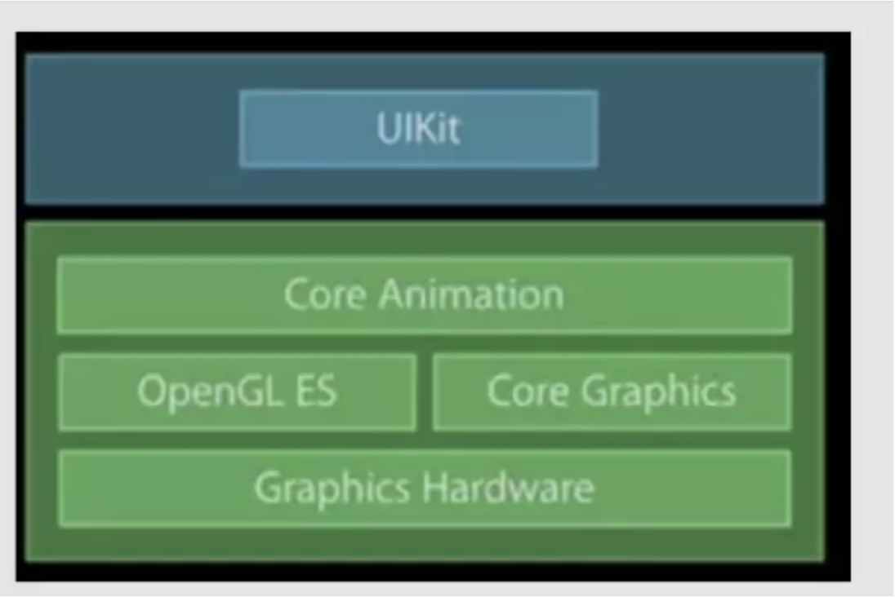
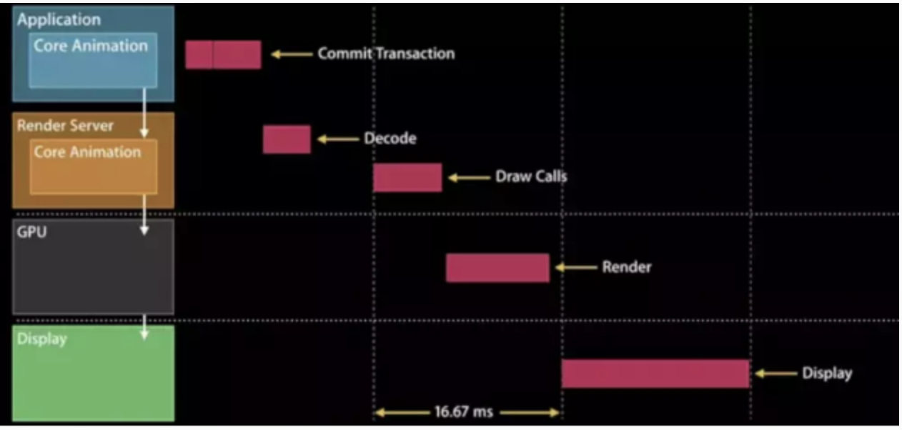

# iOS 界面渲染流程分析
app 从点击屏幕到完全渲染，中间发生了什么?一个UIImageView 添加到视图上以后，内部是如何渲染到手机上的。

# iOS视图渲染
# iOS 渲染视图的核心是Core Animation，其渲染层次依次为:图层数>呈现树>渲染树

# CPU 阶段
* 布局(Frame)
* 显示(Core Graphics)
* 准备(QuartzCore/Core Animation)
* 通过IPC提交(打包好的图层树以及动画属性) 

#OpenGL ES阶段

* 生成(Generate)
* 绑定(Bind)
* 缓存数据(Buffer Data)
* 启用(Enable)
* 设置指针(Draw)
* 清除(Delete)

#GPU 阶段
* 接收提交的纹理(Texture)和顶点描述(三角形)
* 应用变化(trasnform)
* 合并渲染(离屏渲染)

其iOS 平台渲染核心原理重点主要围绕前后帧缓存、Vsync信号、CADisplayLink

##文字简单:
1. 首先一个视图有CPU进行Frame 布局，准备视图和图层的层级关系，查询是否有重写drawRect：或drawLayer:inContext:方法，注意：如果有重写的话，这里的渲染是会占有CPU进行处理的。
2. CPU 会进行处理视图和图层的层级关系打包，通过IPC(内部处理通信)通道提交给渲染服务，渲染服务由OpenGL ES和GPU组成。
3. 渲染服务首先将图层数据交给OpenGL ES 进行纹理生成和着色。生成前后帧缓存，再根据硬件的刷新频率，一般以设备的Vsync信号和CADisplayLink 为标准，进行前后帧缓存切换。、
4. 最后，将最终要显示在画面上的后帧缓存交给GPU，进行采集图片和形状，运行变化，应用文理和混合最终显示在屏幕上。

# 知识点
1. Core Animation
2. CPU 渲染职能
3. OpenGL ES渲染职能
4. GPU 渲染职能
5. IPC内部通信(进程间通信)
6. 前后帧缓存&Vsync信号
7. 视图渲染优化&卡顿优化
8. Metal渲染引擎

Core Animation 是依赖于OpenGL ES做GPU 渲染，CoreGraphics做CPU渲染。

Core Animation 在 RunLoop 中注册了一个 Observer，监听了 BeforeWaiting 和 Exit 事件。这个 Observer 的优先级是 2000000，低于常见的其他 Observer。当一个触摸事件到来时，RunLoop 被唤醒，App 中的代码会执行一些操作，比如创建和调整视图层级、设置 UIView 的 frame、修改 CALayer 的透明度、为视图添加一个动画；这些操作最终都会被 CALayer 捕获，并通过 CATransaction 提交到一个中间状态去（CATransaction 的文档略有提到这些内容，但并不完整）。当上面所有操作结束后，RunLoop 即将进入休眠（或者退出）时，关注该事件的 Observer 都会得到通知。这时 CA 注册的那个 Observer 就会在回调中，把所有的中间状态合并提交到 GPU 去显示；如果此处有动画，CA 会通过 DisplayLink 等机制多次触发相关流程

#CPU 渲染职能
## 显示逻辑
* CoreAnimation 提交会话，包括自己和子树的layout状态等;
* RenderServer解析提交的子数状态，生成绘制指令。
* GPU 执行绘制指令
* 显示渲染后的数据

> http://www.cocoachina.com/ios/20181010/25123.html
