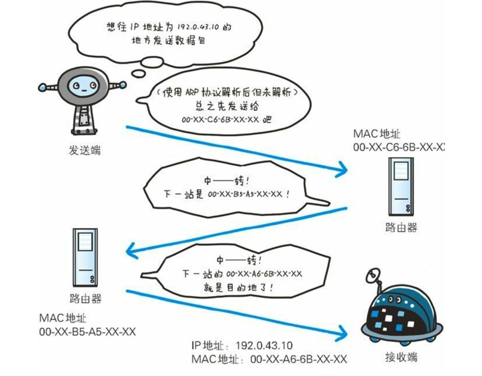
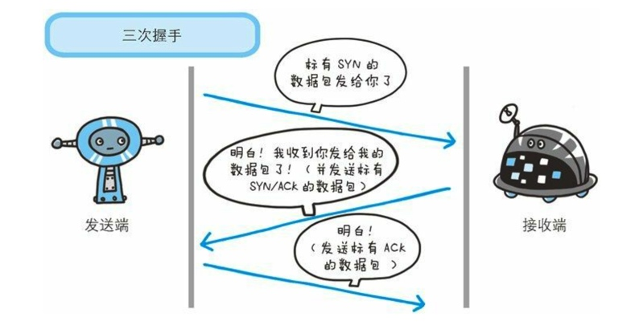
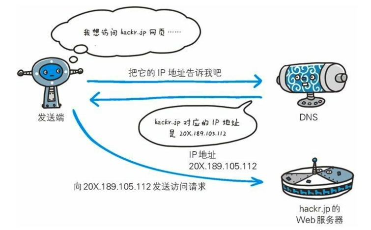
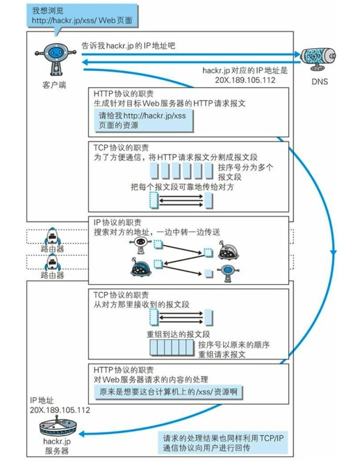
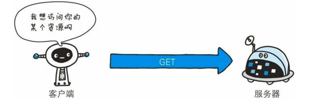
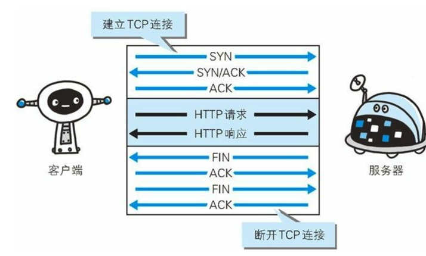
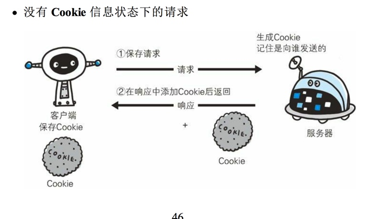
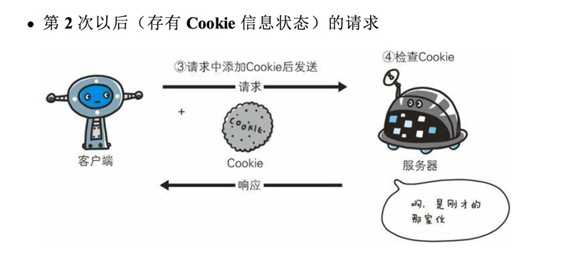

# 网络基础TCP/IP

## 应用层
应用层决定了向用户提供服务时通信的活动，服务有:FTP(文件传输协议)和DNS服务就是其中两类，HTTP协议也处于该层

## 传输层
传输层对上层应用层，提供处于网络连接中的两台计算机之间的数据传输。
在传输层有两个性质不同的协议:TCP(传输控制协议)和UDP(用户数据报协议)。

## 网络层
网络层用来处理在网络上流动的数据包。数据包是网络传输的最小数据单位。该层规定了通过怎么样的路径(所谓的传输路线)到达对方计算机，并把数据包传送给对方。

##数据链路层
用来处理连接网络的硬件部分，包括控制操作系统、硬件的设备光驱动等物理可见部分。

发送端在层与层之间传输数据时，每经过一层时必定会被打上一个该层所属的首部信息。反之，接收端在层与层传输数据时，每经过一层时会把对应的首部消去。

## 与HTTP关系密切的协议:IP、TCP和DNS
### 负责传输的IP协议
IP协议位于网络层，IP协议的作用是把各种数据包传送给对方，而要保证确实传送到对方那里，则需要满足各类条件。其中两个重要的条件是IP地址和MAC地址。
IP地址指明了节点被分配到的地址，MAC地址是指网卡所属的固定地址。IP地址可以和MAC地址进行配对.IP地址可变换，但MAC地址基本不会更改。
使用ARP 协议凭借MAC地址进行通信
ARP协议是一种用以解析地址的协议，根据通信方的IP地址可以反查出对应的MAC地址。                                                                                                                                                                                                   

## 确保可靠性的TCP协议
TCP 协议属于传输层，提供可靠的字节流服务。
所谓的字节流服务是指，为了方便传输，将大块数据分割成以报文段为单位的数据包进行管理，而可靠的传输服务是指，能够把数据准确可靠的传送给对方。
TCP 协议采用了三次握手策略，确保数据是否到达了。TCP协议把数据包送出去后，TCP不会对传送后的情况置之不理，它一定会向对方确认是否成功送达。
握手过程中使用了TCP的标志，SYN和ACK。

发送端首先发送一个带SYN标志的数据包给对方，接收端收到后，回传一个带有SYN/ACK标志的数据包以示传达确认信息。最后，发送端再回传一个带ACK标志的数据包，代表握手结束。
若在握手过程中某个阶段莫名中断，TCP协议会再次以相同的顺序发送相同的数据包。

## 负责域名解析的DNS服务
DNS和HTTP 属于应用层的协议，他提供域名到IP地址之间的解析服务。

## 各种协议与HTTP协议的关系

#简单HTTP协议
## HTTP协议用于客户端和服务器之间的通信
##通过请求和响应的交换达成通信

## 告知服务器意图的HTTP方法
### Get: 获取资源
Get 方法用来请求访问已被URL识别的资源。指定的资源经服务器端解析后返回响应内容。

###Post:传输实体主体
Post方法用来传输实体的主体。虽然可以用GET方法也可以传输实体的主体，但一般不用GET方法进行传输，而是用POST方法。虽说POST的功能与GET很相似，但POST的主要目的并不是获取响应的主体内容。

## 持久连接节省通信量

每进行一次HTTP通信就要断开一次TCP连接。

### 持久连接
持久连接特点,只要任意一端没有明确提出断开连接，则保持TCP连接状态。

### 使用Cookie的状态管理
HTTP是无状态协议，它不对之前发生过的请求和响应的状态进行管理。也就是说，无法根据之前的状态进行本次的请求处理。
Cookie 技术通过在请求和响应报文中写入Cookie信息来控制客户端的状态。Cookie会根据从服务端发送的响应报文内的一个叫做Set-Cookie的首部字段信息，通知客户端保存Cookie。当下次客户端再往该服务器发送请求时，客户端会自动在请求报文中加入Cookie值后发送出去。

