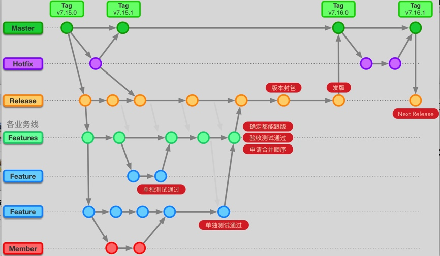

# GitFlow 搭车流程需要细化的点
下面是目前GitFlow的流程。 

## 问题
* Release分支上有更新，如何做到Features分支应该及时更新，不然开发小伙伴使用的是旧代码开发，开发完之后合并的时候会出现很多冲突。

* Release发版的时候，如何做到每个Features都合并了。

* 假设有这样的一个场景，Release、Features分支受保护的，某一天，分支管理者有事没来上班，其他小伙伴就没有权限往Release、Features 分支上合代码，只能让测试在自己分支上测试。所以权限应该让多人有，不能只能一个人有。

* 假设Release、Features都受保护，开发到后期， Features权限是否可以放开，直接在Features分支上解决bug，开发到后期，测试一般都是在Release分支上打包，如果不放开，提交代码要执行两步，先往Features上合，然后Features在往Release上合，如果忘了往Release上合，给测试带来了不便的麻烦。

## 解决方案
这个是美团的解决方案
> https://tech.meituan.com/2019/01/10/traffic-git-branch-management.html
