# 字符串匹配

## BF 算法
我们在主串中，检查起始位置分别是 0、1、2…n-m 且长度...为m的n-m+1个子串，看有没有和模式匹配的。
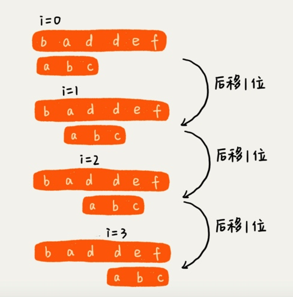

暴力匹配算法，时间复杂度O(n*m)。

## RK 算法
需要用到哈希算法。
时间复杂度是O(n)

## BM 算法
非常高效的字符串匹配算法。

### 核心思想
模式串在主串中不停的往后滑动，当遇到不相同的字符时，BF算法和RK算法的做法是，模式串往后移动一位，然后从模式串第一位开始重新匹配。
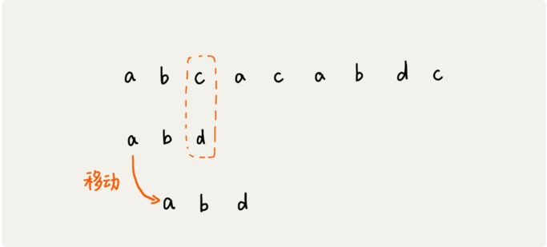

主串中C在模式串中不存在，所以要往后移动，主要是往后移动多少位。

##BM算法原理分析
BM算法包含两部分，分别是**坏字符规则**和**好后缀规则**。

1.坏字符规则
一般匹配思路，按模式串的下标从小到大的顺序，依次与主串中的字符进行匹配的，这种匹配顺序比较符合我们的思维习惯，而BM算法的匹配顺序比较特别，它是按照模式串下标从大到小的顺序，倒着匹配的。
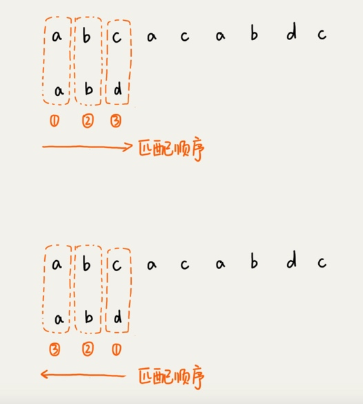

我们从模式串的未尾往前倒着匹配，当我们发现某个字符没法匹配的时候。我们把这个没有匹配的字符叫做**坏字符**。

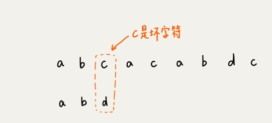

我们拿坏字符C 在模式串中查找，发现模式串中不存在这个字符，也就是说，字符c与模式串中的任何字符都不可能匹配。这个时候，我们可以将模式串直接往后滑动三位，将模式串滑动到c后面的位置，再从模式串的末尾字符开始比较。

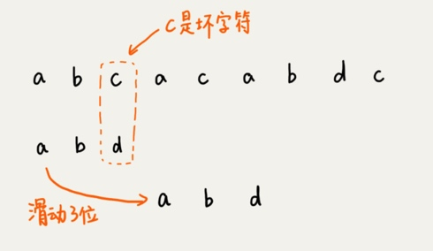

这个时候，我们发现，模式串中最后一个字符d，还是无法跟主串中的a匹配，**这个时候，还能将模式串往后滑动三位吗?答案是不行的，因为这个时候，坏字符a在模式串中是存在的，模式串中下标是0的位置也是字符a,这种情况下，可以将模式串往后滑动两位，让两个a上下对齐，然后从模式串的末尾字符开始，重新匹配。**

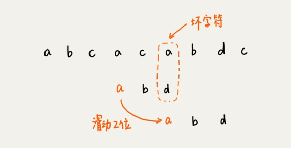


###滑动规则
当发生不匹配的时候，我们把坏字符对应的模式串中的字符下标记作si,如果坏字符在模式串中存在，我们把这个坏字符在模式串中的下标记作xi。如果不存在，我们把xi 记作-1。那模式串往后移动的位数就等于si-xi.
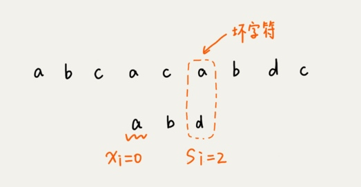
如果坏字符在模式串中多处出现，那我们在计算xi的时候，选择最靠后的那个，因为这样不会让模式串滑动过多，导致本来可能匹配的情况被滑动略过。
利用坏字符规则，BM算法在最好情况下的时间复杂度非常低，是O(n/m)。
单纯使用坏字符规则还是不够的，因为si-xi计算出来的移动位数，有可能是负数，比如主串是aaaaaaaaaaaaaaaa，模式串是baaa,不但不会往后滑动模式串，还有可能倒退。
si = 0, xi = 0, O - (0) = 0,

#### 好后缀规则
好后缀规则实际跟坏字符规则的思路很类似，当模式串滑动到图中的位置的时候，模式串和主串有2个字符是匹配的，倒数第3个字符发生了不匹配的情况。

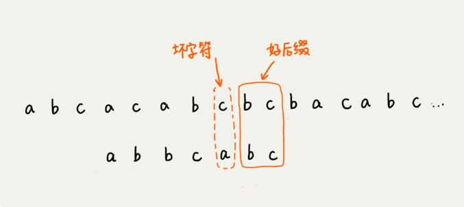

我们把已经匹配的bc叫做好后缀，记作{u}。我们拿它在模式串中查找，如果找到了另一个跟{u}相匹配的子串{u*}，那我们就将模式串滑动到子串{u*}与主串中{u}对齐的位置。

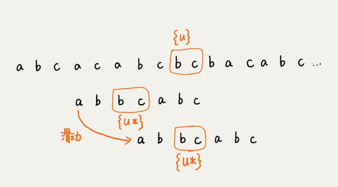
如果在模式串中找不到另一个等于{u}的子串，我们就直接将模式串，滑动到主串{u}的后面，因为之前的任何一次往后滑动，都没有匹配主串{u}的情况。
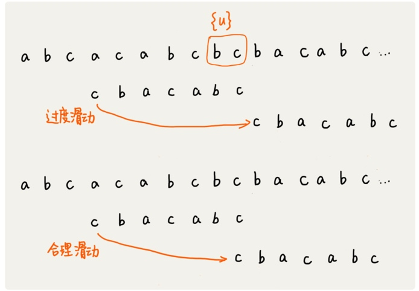
如果好后缀在模式串中不存在可匹配的子串，那在我们一步一步往后滑动模式串的过程中，只要主串中的{u}与模式串有重合，那肯定就无法完全匹配。但是当模式串滑动到前缀与主串中{u}的后缀有部分重合的时候，并且重合的部分相等的时候，就有可能会存在完全匹配的情况。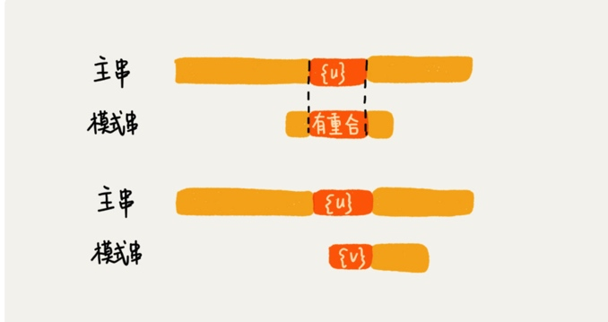
所以，针对这种情况，我们不仅要看好后缀在模式串中，是否有另一个匹配的子串，我们还要考察**好后缀的后缀子串，是否存在跟模式串的前缀子串匹配的**。

当模式串和主串的某个字符不匹配的时候，如何选择用好后缀规则还是坏字符规则，来计算模式串往后滑动的位数?

我们分别计算好后缀和坏字符往后滑动的位数，然后取两个数中最大的，作为模式串往后滑动的位数。

```
a b c a c a b c b c b a c a b c
      c b a c a b c
移动好的           c b a c a b c


好后缀 b c  长度是 2

坏字符是  si = 6  xi = 0   6-xi = 6
```


>https://time.geekbang.org/column/article/71525