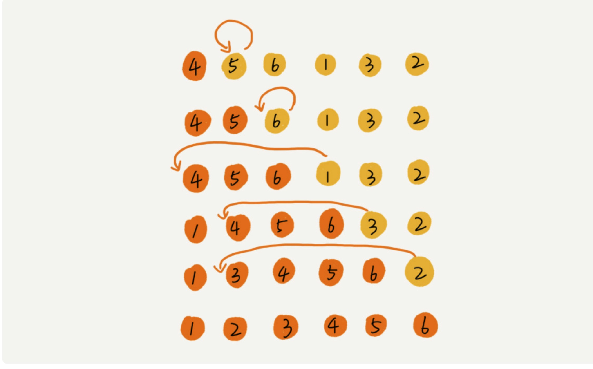
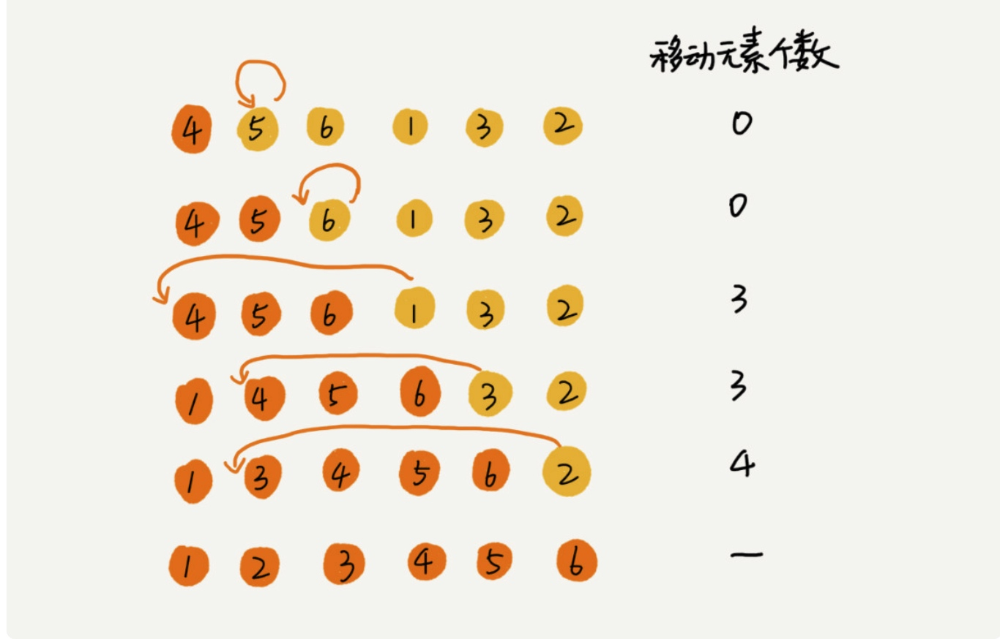

# 排序上
## 冒泡、插入、选择
时间复杂度都是O(n*n)

## 排序算法的执行效率
 1. 最好情况、最坏情况、平均情况时间福再度。
 2. 时间复杂度的系数、常数、低阶。
 3. 比较次数和交换(或移动)次数。
 
## 排序算法的内存消耗
 * 原地排序，就是特指控件空间复杂度是O(1)的排序算法，冒泡、插入和选择都是原地排序算法。
 
## 排序算法的稳定性
 * 稳定性，如果待排序的序列中存在值相等的元素，经过排序之后，相等元素之间原有的先后顺序不变。

## 冒泡排序
当某次冒泡操作已经没有数据交换时，说明已经达到完全有序，不用再继续执行后续的冒泡操作。

```
//冒泡算法，a表示数组，n表示数组大小
public void bubbleSort(int[] a, int n)
{
	if (n <= 1) 
	{
		return;
	}


	for (int i = 0; i < n ; i++) 
	{
boolean flag = false;     
     int temp = 0;
     
     for (int j = i+1; j < n-1; j++) 
     {
     	if (a[i] > a[j]) 
     	{
     		temp = a[i];
     		a[i] = a[j];
     		a[j] = temp;
     		flag =  true;//表示交换了
     	}
     }

if (!flag) {
	break;
}
	}
}

```

* 冒泡算法是原地排序算法吗?
 1. 冒泡的过程只涉及相邻数据的交换，只需要常量级的临时空间，所以它的空间复杂度为O(1),是原地排序的算法。
* 冒泡算法的时间复杂度是O(n * n),最好是O(n),最坏是O(n * n)
* 平均复杂度，可以通过**有序度**和**逆序度**这两个概念来进行分析

### 有序度

 ```
 有序度是数组中具有有序关系的元素对的个数，有序元素对数学表 达式标识就是这样：
 有序元素对: a[i] <= a[j],如果 i < j。
 2,4,3,1,5,6 这组数据的有序度为11，因其有序元素对为11个，分别是:
 (2,4) (2,3),(2,5),(2,6)
 (4,5) (4,6) 
 (3,5) (3,6)
 (1,5) (1,6)
 (5,6)
 
 ```
 同理，对于一个倒序的排列数组，比如6,5,4,3,2,1， 有序度是0；对于一个完全有序的数组，1，2，3，4，5，6，有序度是n * (n-1)/2 就是15,我们把这种完全有序的数组的有序度叫做**满有序度**。
 
 ### 逆序度
 逆序度的定义正好跟有序度相反(默认从小到大为有序) 。
 ```
 逆序元素对: a[i] > a[j] 如果 i < j。
 ```
 关于这三个概念，我们可以得到一个公式: 逆序度 = 满有序度 - 有序度。我们排序的过程就有一种增加有序度，减少逆序度的过程，最后达到满有序度，就说明排序完成。
 
 ```
 4,5,6,3,2,1,其中，有序元素对是
 (4, 5)(4, 6)
 (5, 6)
 所以有序度是3。 n = 6 所以 排完序之后终态的满意度为 6*(6-1) = 15; 15 - 3 = 12 。要交换12次。
对于包含n个数据进行冒泡排序，平均交换次数是多少次呢? 最坏的情况初始状态的有序度是0，所以要进行 n * (n-1)/2 次交换。最好的情况下，初始化状态的有序度是n * (n-1)/2，就不需要进行交换。所以我们可以取中间值 n * (n-1)/4，来表示初始有序度既不是很高也不是很低的平均情况。
换句话说，平均情况下，需要n*(n-1)/4 次交换操作，比较操作肯定要比交换操作多，而复杂度的上线是O(n * n),所以平均情况下的时间复杂度是O(n * n)

``` 
 
## 插入排序
 一个有序的数组，我们往里面添加一个新的数据后，如何继续保持数据有序呢? 很简单，我们只要遍历数组，找到数据应该插入的位置将其插入即可。
 
首先，我们将数组中的数据分为两个区间，**已排序区间**和**未排序区间** ，初始已排序区间只有一个元素，就是数组的第一个元素。插入算法的核心思想是取未排序区间的元素，在已排序区间中找到合适的插入位置将其插入，并保证已排序区间数据一直有序。重复这个过程，知道未排序区间中元素为空，算法结束。


插入排序包含两种操作，一种是**元素的比较**,一种是元素的移动。当我们需要将一个数据a 插入到已排序区间时，需要拿a与已排序区间的元素依次比较大小，找到合适的插入位置。找到插入点之后，我们还需要将插入点之后的元素顺序往后移动一位，这样才能腾出位置给元素a插入。

对于不同的查找插入点方法，元素的比较次数是有区别的。但对于一个给定的初始序列，移动操作的次数总是固定的，就等于逆序度。为什么这样说呢，拿上面的列子举例。
```
6个元素，满有序度是15。
有序列
(4,5) (4,6)
(5,6)
(1,3) (1,2)
15 - 5 = 10;
``` 


```
public void insertionSort(int a[],int n){
if (n <= 1) return;

for (int i = 1; i < n;i++){
int temp = a[i];
  for (int j= i-1 ;j>0; j--)
  {
       if(a[j] > temp)
       {
          a[j+1] = a[j];
       }else
       {
         break;
       }
 }
 a[j+1] = temp;
  
                  }
}

```

##选择排序

选择排序算法的实现思路有点类似插入排序，也分已排序区间和未排序区间。但是选择排序每次会从未排序区间中找到最小的元素，将其放到已排序区间的末尾。


```
 // 选择排序，a表示数组，n表示数组大小
  public static void selectionSort(int[] a, int n) {
    if (n <= 1) return;

    for (int i = 0; i < n - 1; ++i) {
      // 查找最小值
      int minIndex = i;
      for (int j = i + 1; j < n; ++j) {
        if (a[j] < a[minIndex]) {
          minIndex = j;
        }
      }
      
      // 交换
      int tmp = a[i];
      a[i] = a[minIndex];
      a[minIndex] = tmp;
    }
  }


```


> https://time.geekbang.org/column/article/41802
 
