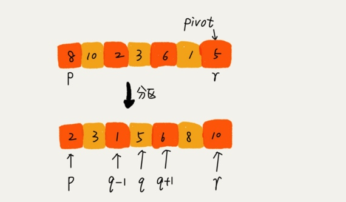
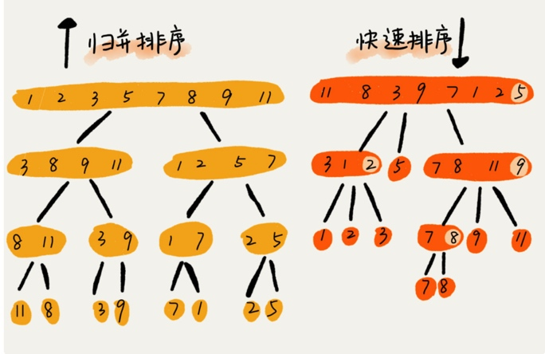

# 排序下
冒泡排序、插入排序、选择排序这三种排序算法，时间复杂度都是O(n*n),比较高，适合小规模数据的排序。下面时间复杂度为O(nlogn)的排序算法，归并排序和快速排序。这两种排序算法适合大规模数据排序。

归并排序和快速排序都用到了分治思想，非常巧妙。比如， **如何在O(n)的时间复杂度内查找一个无序数组中的第K大元素?**

## 归并排序的原理
归并排序的核心思想:如果要排序一个数组，我们先把数组从中间分成前后两部分，然后对前后两部分分别排序，再将排好序的两部分合并正在一起，这样整个数组就都有序了。**分治是一种解决问题的处理思想，递归是一种编程技巧**,

```
递推公式:
merge_sort(p...r) = merge(merge_sort(p...q),merge_sort(q+1...r))

终止条件:
p >= r 不用再继续分解
```
代码
```
//归并排序算法，A是数组，n表示数组大小

merge_sort(A, n){
merge_sort_c(A,0,n-1)
}

//递归调用函数
merge_sort_c(A,p,r){
//递归终止条件
if p >= r then return

//取p到r之间的中间位置q
q = (p+r)/2
//分治递归
merg_sort_c(A,p,q)
merg_sort_c(A,q+1,r)
//将 A[p...q] 和A[q+1...r] 合并为A[p...r]
merge(A[p...r],A[p...q],A[q+1...r])
}
```
伪代码
```
merge(A[p...r], A[p...q], A[q+1...r]) {
  var i := p，j := q+1，k := 0 // 初始化变量 i, j, k
  var tmp := new array[0...r-p] // 申请一个大小跟 A[p...r] 一样的临时数组
  while i<=q AND j<=r do {
    if A[i] <= A[j] {
      tmp[k++] = A[i++] // i++ 等于 i:=i+1
    } else {
      tmp[k++] = A[j++]
    }
  }
  
  // 判断哪个子数组中有剩余的数据
  var start := i，end := q
  if j<=r then start := j, end:=r
  
  // 将剩余的数据拷贝到临时数组 tmp
  while start <= end do {
    tmp[k++] = A[start++]
  }
  
  // 将 tmp 中的数组拷贝回 A[p...r]
  for i:=0 to r-p do {
    A[p+i] = tmp[i]
  }
}
```
归并排序时间复杂度
O(nlogn),不管是最好情况、最坏情况、还是平均情况，时间复杂度都是O(nlogn)。

**归并排序的空间复杂度是多少?**
归并排序不是原地排序算法，因为归并排序的合并函数，在合并两个有序数组为一个有序数组时，需要借助额外的存储空间,空间复杂度是O(n)。

##快速排序的原理##
快排思想:如果要排序的数组中下标从p到r之间的一组数据，我们选择p到r之间的任意一个数据作为pivot(分区点)。
我们遍历p到r之间的数据，将小于pivot的放到左边，将大于pivot的放到右边，将pivot 放到中间。经过这一步骤之后，数组p到r之间的数据就被分成了三个部分，前面p到q-1之间都是小于pivot的，中间是pivot，后面q+1到r之间是大于pivot的。



```
递推公式：
quick_sort(p…r) = quick_sort(p…q-1) + quick_sort(q+1, r)

终止条件：
p >= r

// 快速排序，A 是数组，n 表示数组的大小
quick_sort(A, n) {
  quick_sort_c(A, 0, n-1)
}
// 快速排序递归函数，p,r 为下标
quick_sort_c(A, p, r) {
  if p >= r then return
  
  q = partition(A, p, r) // 获取分区点
  quick_sort_c(A, p, q-1)
  quick_sort_c(A, q+1, r)
}
```
partition()分区函数实际上是随机选择一个元素作为pivot(一般情况下，可以选择p到区间的最后一个元素)，然后对A[p...r]分区，函数返回pivot的下标。

如果不考虑空间的消耗的话，partition()分区函数可以写的非常简单，我们申请两个临时数组X和Y，遍历A[p...r]，将小于pivot的元素都拷贝到临时数组X,将大于pivot的元素都拷贝到临时数组Y，最后再将数组X和数组Y中数据顺序拷贝到A[p...r]。

但是partition()函数就需要更多额外的内存空间，所以快排就不是原地排序算法了。如果我们希望快排是原地排序算法，那它的空间复杂度是O(1),那partition()分区函数就不能占用太多额外的内存空间，我们就需要在A[p...r]的原地完成分区操作。

```
partition(A, p, r) {
  pivot := A[r]
  i := p
  for j := p to r-1 do {
    if A[j] < pivot {
      swap A[i] with A[j]
      i := i+1
    }
  }
  swap A[i] with A[r]
  return i
```
处理类似选择排序，通过游标i把A[p...r-1]分成两部分。A[p...i-1]的元素都是小于pivot的，我们暂且叫它"已处理区间"，A[i...r]是"未处理区间"。我们每次都从未处理的区间A[i...r-1]中取一个元素A[j]，与pivot对比，如果小于pivot，则将其加入到已处理区间的尾部，也就是A[i]的位置。


归并排序是由下往上，快速排序是由上往下
归并处理过程是先处理子问题，然后在合并。而快速排序是先分区然后在处理子问题。归并非原地排序，快速排序是原地排序。
T(n)在大部分情况下的时间复杂度都可以做到O(nlogn)，只有在极端情况下，才会退化到O(n*n)。
