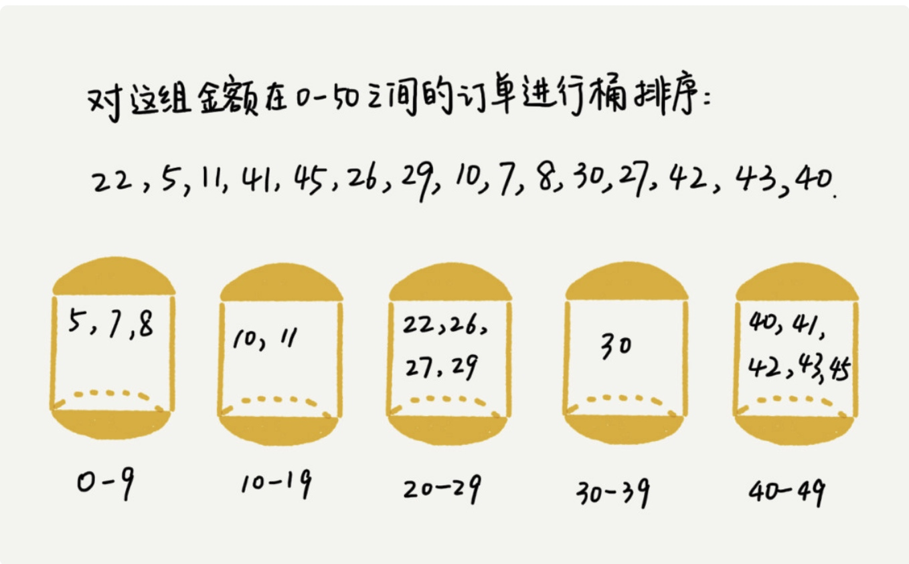

# 线性排序

桶排序、计数排序、基数排序，时间复杂度是O(n)，时间复杂度是线性的，我们把这类排序算法叫做**线性排序**。之所以能做到线性的时间复杂度，主要原因是，这三个算法是非基于比较的排序算法那，都不涉及元素的比较操作。

这几种排序算法理解起来都不难，时间、空间复杂度分析起来也很简单，但是对要排序的数据要求很苛刻，所以**学习重点的掌握这些排序算法的适用场景**。

##桶排序
将要排序的数据分到几个有序的桶里面，每个桶里面的数据再单独进行排序，桶内排完序之后，在把每个桶里面的数据按照顺序依次取出，组成的序列就是有序的。

桶排序时间复杂度是O(n)，排序的数据有n个，我们把他们均匀的划分到m个桶内，每个桶里面就有k=n/m个元素。每个桶内部使用快速排序，时间复杂度为O(k*logk)。m个桶排序的时间复杂度就是O(m*k*logk),因为k = n/m ,所以整个桶排序的时间复杂度就是O(n*log(n/m))。当桶的个数m接近数据个数n时，log(n/m)就是一个非常小的常量，整个时候桶排序的时间复杂度接近O(n)。

桶排序对要排序数据的要求非常苛刻。

要排序的数据需要划分成m个桶，并且，桶与桶之间有着天然的大小顺序。这样每个桶内的数据都排序完之后，桶与桶之间的数据不需要再进行排序。

数据在各个桶之间的分布比较均匀的。如果数据经过桶的划分之后，有些桶里的数据非常多，有的非常少，很不均匀，那桶内数据排序的时间复杂度就不是常量级了。在极端情况下，如果数据都被划分到一个桶里，那就退换成O(nlogn)的排序算法。

**桶排序比较适合用在外部排序中**。所谓的外部排序就是数据存储在外部磁盘中，数据量比较大，内存有限，无法将数据全部加载到内存中。

> https://time.geekbang.org/column/article/42038