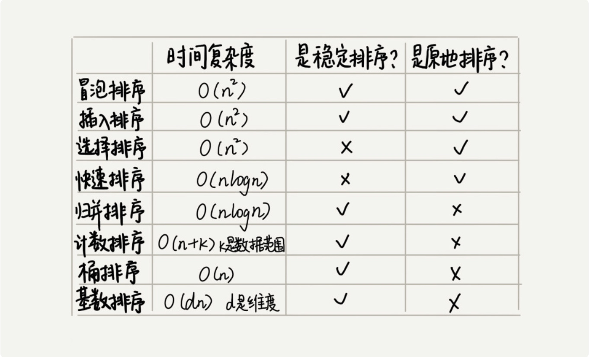

# 排序总结

线性排序算法的时间复杂度比较低，适用场景比较特殊，适用场景比较特殊，所以要写一个通用的排序函数，不能选择线性排序算法。

如果小规模数据进行排序，可以选择时间复杂度是O(n*n)的算法;如果对大规模数据进行排序，时间复杂度是O(nlogn)的算法更加高效。所以为了兼顾任意规模数据的排序，一般都会首选时间复杂度是O(nlogn)的排序算法来实现排序函数。

归并排序在实际开发中用的不多，归并排序平均、最坏情况下时间复杂度都是O(nlogn)，归并排序并不是原地排序，空间复杂度是O(n)。

> https://time.geekbang.org/column/article/42359