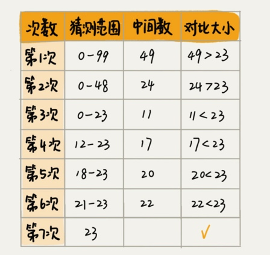
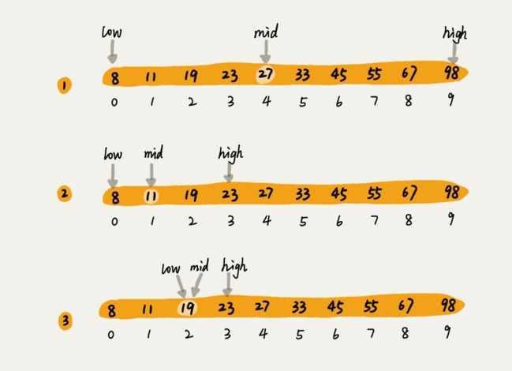

# 二分查找上：如何用最省内存的方式实现快速查找功能

**二分查找针对的是一个有序的数据集合，查找思想有点类似分治思想。每次都通过区间的中间元素(如果中间元素有两个，选择小的一个)对比，将待查找的区间缩小为之前的一半，直到找到要查找的元素，或者区间被缩小为0。**

O(logn)惊人的查找速度




找到19元的订单


二分查找针对的是一个有序的数据集合，查找思想有点类似分治思想。每次都通过和区间的中间元素对比，将待查找的区间缩小为之前的一半，直到找到要查找的元素，或者区间被缩小为0。

##最简单的情况是有序数组中不存在重复元素
```
public int bsearch(int[] a, int n, int value){
int low = 0;
int high = n - 1;
while (low <= high){
int mid = (low + high)/2;
if(a[mid] == value){
return mid;
}else if( a[mid] < value){
low = mid +1;
}else{
high = mid - 1;
}
 }
 return - 1;
}
```

## 容易出错的3个地方

1. 循环退出条件
low <= high 
2. mid的取值
```
实际上，mid = (low + high)/2 这种写法是有问题的，因为如果low和high比较大的话，两者之和就有可能溢出。改进的方法是将mid的计算方式写成low+(high-low)/2。更进一步，如果要将性能优化到极致的话，我们可以将这里的除以2操作化成位运算low + ((high-low)>>1)。
``` 
3. low和high的更新
low = mid + 1,high = mid - 1。

二分查找除了用循环来实现，还可以用递归来实现。
```
// 二分查找的递归实现
public int bsearch(int[] a, int n, int val) {
  return bsearchInternally(a, 0, n - 1, val);
}

private int bsearchInternally(int[] a, int low, int high, int value) {
  if (low > high) return -1;

  int mid =  low + ((high - low) >> 1);
  if (a[mid] == value) {
    return mid;
  } else if (a[mid] < value) {
    return bsearchInternally(a, mid+1, high, value);
  } else {
    return bsearchInternally(a, low, mid-1, value);
  }
}

```

## 二分查找应用场景的局限性
* 二分查找依赖的是顺序表结构，简单是数组。不可以使用链表，链表随机访问的时间复杂度是O(n),数组下标随机访问的数据的时间复杂度是O(1),而链表随机访问的时间复杂度是O(n)。所以数据使用链表储存，二分查找的时间复杂就会变得很高。
* 二分查找针对的是有序数据，如果数据没有序，我们需要先排序，排序需要频繁插入和删除操作。
* 数据量太小和太大都不适合二分查找。因为依赖数组，数组是连续的存储空间，太大了就浪费存储空间。


> https://time.geekbang.org/column/article/42520