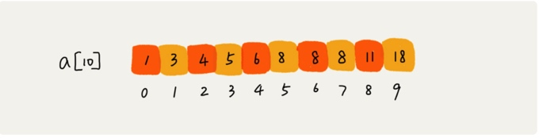

# 二分查找下:如何快速定位IP对应的省份地址?
## 二分查找变形
* 查找一个值等于给定值的元素。
* 查找最后一个值等于给定值的元素。
* 查找第一个大于等于给定值的元素。
* 查找最后一个小于等于给定值的元素。

### 查找第一个值等于给定值的元素


low + (low + high)/2;
其中 a[5],a[6],a[7]的值都是8，是重复的数据。我们希望查找第一个等于8的数据，也就是下标为5的元素。
使用二分查找的代码来实现，首先拿8与区间的中间值a[4]比较，8比6大，于是在下标5到9之间继续查找。下标5和9的中间位置是下标是7,a[7]正好等于8，所以代码就返回了。
尽管a[7]也等于8，但它不是我们想要的第一个等于8的元素，因为第一个值等于8的元素是数组下标为5的元素。

```
public int bsearch(int[] a, int n, int value) {
  int low = 0;
  int high = n - 1;
  while (low <= high) {
    int mid = low + ((high - low) >> 1);
    if (a[mid] > value) {
      high = mid - 1;
    } else if (a[mid] < value) {
      low = mid + 1;
    } else {
      if ((mid == 0) || (a[mid - 1] != value)) return mid;
      else high = mid - 1;
    }
  }
  return -1;
}

```

### 查找最后一个值等于给定值的元素

```
public int bsearch(int[] a, int n, int value) {
  int low = 0;
  int high = n - 1;
  while (low <= high) {
    int mid =  low + ((high - low) >> 1);
    if (a[mid] > value) {
      high = mid - 1;
    } else if (a[mid] < value) {
      low = mid + 1;
    } else {
      if ((mid == n - 1) || (a[mid + 1] != value)) return mid;
      else low = mid + 1;
    }
  }
  return -1;
}

```
### 查找第一个大于等于给定值的元素

```
public int bsearch(int[] a, int n, int value) {
  int low = 0;
  int high = n - 1;
  while (low <= high) {
    int mid =  low + ((high - low) >> 1);
    if (a[mid] >= value) {
      if ((mid == 0) || (a[mid - 1] < value)) return mid;
      else high = mid - 1;
    } else {
      low = mid + 1;
    }
  }
  return -1;
}

```

###查找最后一个小于等于给定值的元素
```
public int bsearch7(int[] a, int n, int value) {
  int low = 0;
  int high = n - 1;
  while (low <= high) {
    int mid =  low + ((high - low) >> 1);
    if (a[mid] > value) {
      high = mid - 1;
    } else {
      if ((mid == n - 1) || (a[mid + 1] > value)) return mid;
      else low = mid + 1;
    }
  }
  return -1;
}

```

> https://time.geekbang.org/column/article/42733