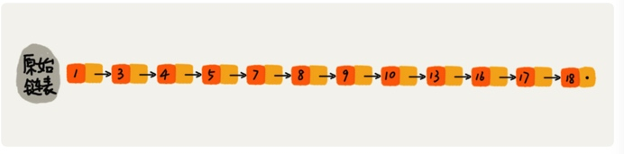
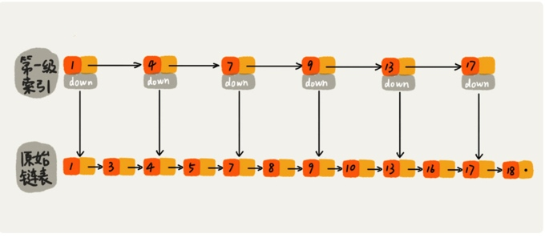
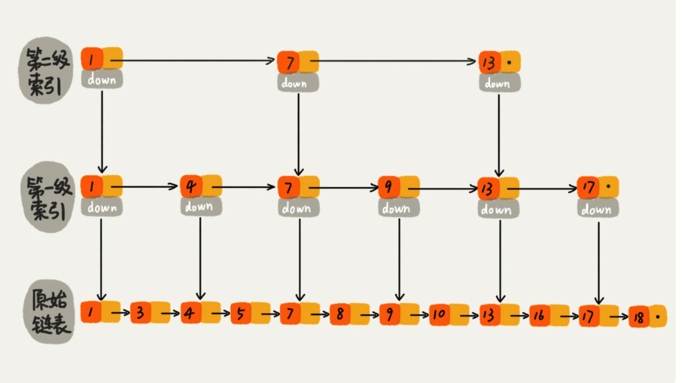
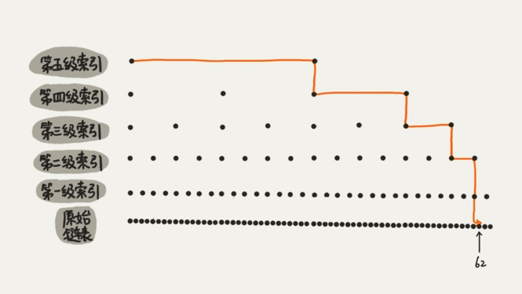

# 跳表

二分查找算法需要查找访问下标，所以用数组，如果用链表来存储数据，对链表稍加改造，就可以支持二分的查找算法，我们把改造后的数据结构叫做**跳表**。

## 理解跳表
对一个单链表来说，即便链表中存储的数据是有的，查找数据只能从头到尾遍历链表，这样查找效率就会很低，时间复杂度很高，是O(n)。

提高查找效率，只能建立**索引**或**索引层**。

链表加多级索引的结构，就是跳表。
两个结点会抽出一个结点作为上一级索引的结点。**第k级索引的结点个数是第k-1级索引的结点个数的1/2，那第k级索引结点的个数就是n/(2的k次方)**

空间换时间的设计思路。

##复杂度
查找、插入、删除操作时间复杂度是O(logn)。

> https://time.geekbang.org/column/article/42896