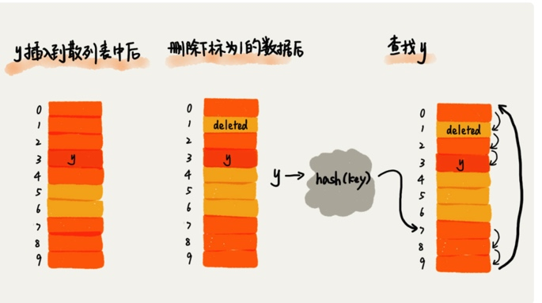
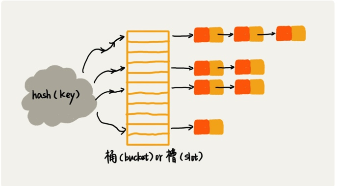

# 散列表
## word文档中的单词拼写检查功能
**散列表就是哈希表，散列表用的是数组支持按照下标随机访问数据的特性，所以散列表其实就是数组的一种扩展，由数组演化而来。可以说，如果没有数组，就没有散列表。**

## 规律
散列表用的就是数组支持按照下标随机访问的时候，时间复杂度是O(1)的特性，我们通过散列函数把元素的健值映射为下标，然后将数据存储在数组中对应下标的位置。当我们按照健值查询元素时，我们用同样散列函数，将健值转化数组下标，从对应的数组下标的位置取数据。

## 散列冲突
1. 开放寻址法
如果出现了散列冲突，我们就重新探测一个空闲的位置，将其插入。那如何重新探测新的位置呢? **线性探测**。

当我们往散列表中插入数据时，如果某个数据经过散列函数之后，存储位置已经被占用了，我们就从当前位置开始，依次往后查找，看是否有空闲位置，直到找到为止。

散列表中查找元素的过程有点类似插入过程。我们通过散列函数求出要查找元素的健值对应的散列值，然后比较数组中下标为散列值的元素和要查找的元素。如果相等，则说明就是我们要找的元素，否则就顺序往后查找，如果遍历到数组中的空闲位置，还没有找到，就说明要查找的元素并没有在散列表中。

散列表删除元素的操作，对于使用线性探测法解决冲突的散列表，删除操作稍微有些特别。我们不能单纯的把删除的元素设置为空，因为在我们查找元素的过程中，如果发现位置为空，我们就把元素放入到那个位置，但是如果这个空闲位置是我们之前删除的，就会导致原来的查找算法失效。

我们可以将删除的元素，特殊标记为deleted。当线性探测查找的时候，遇到标记为deleted的空间，并不是停下来，而是继续往下探测。


极端情况下我们需要探测整个散列表，时间复杂度是O(n)，同理，删除和查找也有可能会线性探测整张散列表，才能找到要查找或者删除的数据。

对于开放寻址冲突解决方法，除了线性探测方法外，我们另外还有两种比较经典的探测方法，**二次探测**，**双重散列**。

装载因子
```
散列表的装载因子 = 填入表中的元素个数 / 散列表的长度
```
装载因子越大，说明空闲位置越少，冲突越多，散列表的性能会下降。

## 链表法
所有散列值相同的元素我们都放到相同槽对应的链表中。


插入的时间复杂度是O(1),查找和删除元素时，时间复杂度是O(k)
k = n/m;

## 散列表两个核心问题
**散列函数设计和散列冲突解决**。散列冲突有两种常用的解决方法，开放寻址法和链表法。散列函数设计的好坏决定了散列冲突的概率，也就决定散列表的性能。


