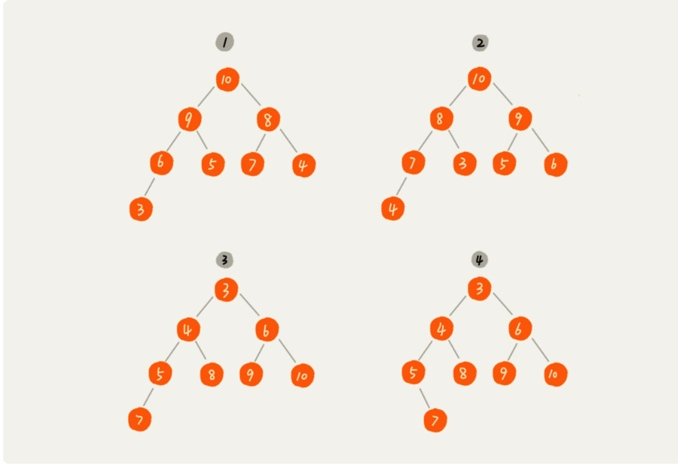
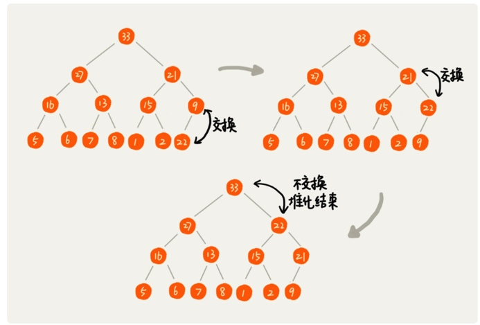

# 堆和堆排序
## 时间复杂度
堆排序是一种原地的、时间复杂度为O(nlogn)的排序算法。
快速排序平均情况下时间复杂度为O(nlogn)，甚至堆排序比快速排序的时间复杂度还要稳定，但是，在**实际的软件开发中，快速排序的性能要比堆排序好**

##堆
堆是一种特殊的树。
* 堆是一个完全二叉树
* 堆中每一个节点的值都必须大于等于(或小于等于)其子树中每个节点的值。

完全二叉树要求，除了最后一层，其他层的节点个数都是满的，最后一层的节点都靠左排列。


4不是完全二叉树，所以不是。 1、2、3 是堆，1和2是大根堆，3是小根堆。

##如何实现一个堆
完全二叉树比较适合用数组来存储。用数组来存储完全二叉树是非常节省存储空间的，因为我们不需要存储左右子节点的指针，单纯地通过数组的下标，就可以找到一个节点的左右子节点和父节点。

数组中下标为i的节点的左子节点，就是下标为i*2的节点，右子节点就是下标为 i*2 + 1的节点,父节点就是下标为i/2的节点。

1. 往堆中插入一个元素
往堆中插入一个元素，需要进行调整，这个过程叫做**堆化**
堆化实际上有两种，从下往上和从上往下。




```
public class Heap {
  private int[] a; // 数组，从下标 1 开始存储数据
  private int n;  // 堆可以存储的最大数据个数
  private int count; // 堆中已经存储的数据个数

  public Heap(int capacity) {
    a = new int[capacity + 1];
    n = capacity;
    count = 0;
  }

  public void insert(int data) {
    if (count >= n) return; // 堆满了
    ++count;
    a[count] = data;
    int i = count;
    while (i/2 > 0 && a[i] > a[i/2]) { // 自下往上堆化
      swap(a, i, i/2); // swap() 函数作用：交换下标为 i 和 i/2 的两个元素
      i = i/2;
    }
  }
 }

```


```
public void removeMax() {
  if (count == 0) return -1; // 堆中没有数据
  a[1] = a[count];
  --count;
  heapify(a, count, 1);
}

private void heapify(int[] a, int n, int i) { // 自上往下堆化
  while (true) {
    int maxPos = i;
    if (i*2 <= n && a[i] < a[i*2]) maxPos = i*2;
    else if (i*2+1 <= n && a[maxPos] < a[i*2+1]) maxPos = i*2+1;
    else if (maxPos == i) break;
    swap(a, i, maxPos);
    i = maxPos;
  }
}
```

## 堆实现排序
时间复杂度是O(n*n)的冒泡排序、插入排序、选择排序，有时间复杂度是O(nlogn)的归并排序、快速排序，还有O(n)的线性排序。

1. 建堆
我们首先将数组原地建成一个堆。所谓"原地"就是，不借助另一个数组，就在原数组上操作，建堆的过程，两种思路。

第一种，在堆中插入一个元素的思路。尽管数组中包含n个数据，但是我们可以假设，起初堆中只包含一个数据，就是下标为1的数据。然后，我们调用前面说的插入操作，将下标从2到n的数据依次插入到堆中，这样我们就包含n个数据的数组，组织成了堆。


```
private static void buildHeap(int[] a, int n) {
  for (int i = n/2; i >= 1; --i) {
    heapify(a, n, i);
  }
}

private static void heapify(int[] a, int n, int i) {
  while (true) {
    int maxPos = i;
    if (i*2 <= n && a[i] < a[i*2]) maxPos = i*2;
    else if (i*2+1 <= n && a[maxPos] < a[i*2+1]) maxPos = i*2+1;
    else if (maxPos == i) break;
    swap(a, i, maxPos);
    i = maxPos;
  }
}

```
在这段代码中，我们对下标从n/2开始到1的数据进行堆化，下标是n/2 + 1 到n的节点是叶子节点，我们不需要堆化。建堆的时间复杂度就是O(n)。


>https://time.geekbang.org/column/article/69913