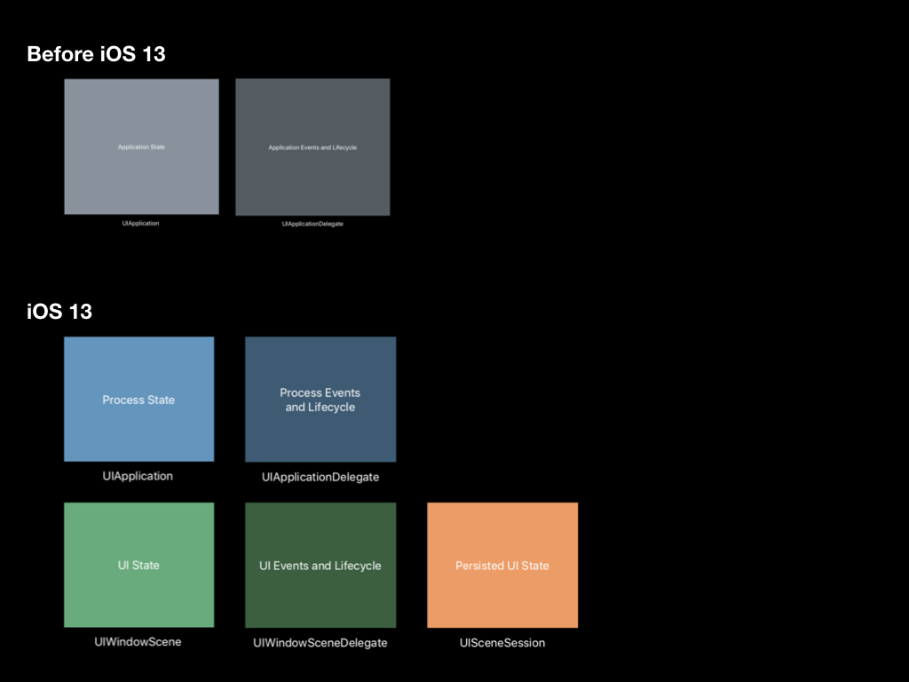

# What's new in Xcode 11
## 版本编辑
1. 可以分屏
2. Design Tools
 * 在StoryBoard 中增加了对 Dark Mode 的预览支持，图片.asset
 
# 苹果账号登录 swift 
https://developer.apple.com/documentation/authenticationservices/adding_the_sign_in_with_apple_flow_to_your_app

第三方登录要支持苹果登录
Sign In with Apple will be available for beta testing this summer. It will be required as an option for users in apps that support third-party sign-in when it is commercially available later this year.

#iPad 多窗口
https://xiaozhuanlan.com/topic/0342159876

https://developer.apple.com/documentation/uikit/app_and_scenes?changes=latest_minor&language=objc
原本由 UIApplication 负责应用状态，UIApplicationDelegate 负责应用事件与生命周期的划分已经没法很好的满足需求。因此 Apple 在此基础上做了进一步的拆分：UIApplication 仍作为一个系统进程表示系统状态，UIApplicationDelegate 负责进程的事件和生命周期，能获取到应用启动与终止等相关的通知；UIWindowScene 中封装了各类 UI 状态，如 status bar 等相关的事情现在由它负责；UIWindowSceneDelegate 负责 UI 事件和生命周期，如打开 URL，scene 回到了前台或后台等；UISceneSession 则负责持久化的 UI 状态。

# Data Source 新特性：基于 Diffable 实现局部刷新

# 增加临时定位功能
https://xiaozhuanlan.com/topic/4209567831

https://developer.apple.com/videos/play/wwdc2019/705/

# 全新后台任务框架及最佳实践
https://xiaozhuanlan.com/topic/1806594273
https://developer.apple.com/videos/play/wwdc2019/707/