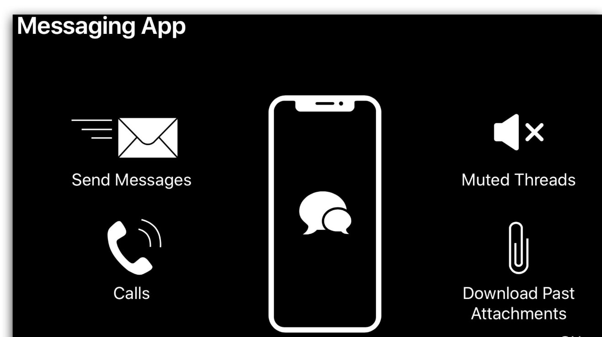

# 全新后台任务框架
## 想象一下一个类似微信的即时通讯软件拥有的一些功能：即时消息、勿扰模式、VoIP、历史记录下载等，对于这些功能，结合系统提供的各种后台任务应用场景，该以何种姿势使用这些 API 呢？且往下看


即时消息肯定需要确保时效性，尽可能快的触达对方才能保证良好的用户体验。但是某些情况下（比如较差网络环境），不一定能马上将消息发送到对方，此时用户可能切回到桌面或者其它应用，那么如何才能保证发送消息这个操作完成呢？答案就是使用 Background Task Completion 相关 API。
```
// Guarding Important Tasks While App is Still in the Foreground
func send(_ message: Message) {
    let sendOperation = SendOperation(message: message)
    var identifier: UIBackgroundTaskIdentifier!
    // 1
    identifier = UIApplication.shared.beginBackgroundTask(expirationHandler: {
        // 2
        sendOperation.cancel()
        postUserNotification("Message not sent, please resend")
        // Background task will be ended in the operation's completion block below
    })
    sendOperation.completionBlock = {
        // 3
        UIApplication.shared.endBackgroundTask(identifier)
    }
    operationQueue.addOperation(sendOperation)
}
```
让我们依次看看上面标注的步骤：

1. 应用在前台时通过对应 API 创建一个后台任务，此时即使 app 进入后台，也会获得一定的时间来处理消息发送。
2. 在系统给出的时间内还没有处理完，应用即将被挂起，则取消发送，同时本地 push 通知用户。
3. 如果发送成功，则通知系统该任务已结束，以此降低对电量的消耗。
##电话
有些时候会觉得打字麻烦而直接打电话，系统同样也提供了对应的 API————VoIP 通知。它是一种特殊的通知类型，可以唤起应用，提醒用户有电话呼入，代码实现起来也比较简单
```
func registerForVoIPPushes() {
    self.voipRegistry = PKPushRegistry(queue: nil)
    self.voipRegistry.delegate = self
    self.voipRegistry.desiredPushTypes = [.voIP]
}
```
同时必须在 didReceiveIncomingPush 回调中使用 CallKit 来处理 VoIP push 通知，否则系统会“杀”掉应用，并且系统可能在收到 VoIP 通知时不再唤起应用。

```
let provider = CXProvider(configuration: providerConfiguration)

func pushRegistry(_ registry: PKPushRegistry, didReceiveIncomingPushWith payload:
PKPushPayload, for type: PKPushType, completion: @escaping () -> Void) {
    if type == .voIP {
        if let handle = payload.dictionaryPayload["handle"] as? String {
            let callUpdate = CXCallUpdate()
            callUpdate.remoteHandle = CXHandle(type: .phoneNumber, value: handle)
            let callUUID = UUID()
            provider.reportNewIncomingCall(with: callUUID, update: callUpdate) { _ in
                completion()
            }
            establishConnection(for: callUUID)
        }
    }
}
```

#勿扰模式
微信中通常聊天列表里躺着几十个甚至上百个会话，有些活跃的群可能一天有上千条信息，如果一直收到 push，肯定会不胜其烦。所以一般都会对这个群开启消息免打扰模式，但是又不想错过重要信息（比如被别人@）


> https://xiaozhuanlan.com/topic/1806594273
> https://developer.apple.com/videos/play/wwdc2019/707/