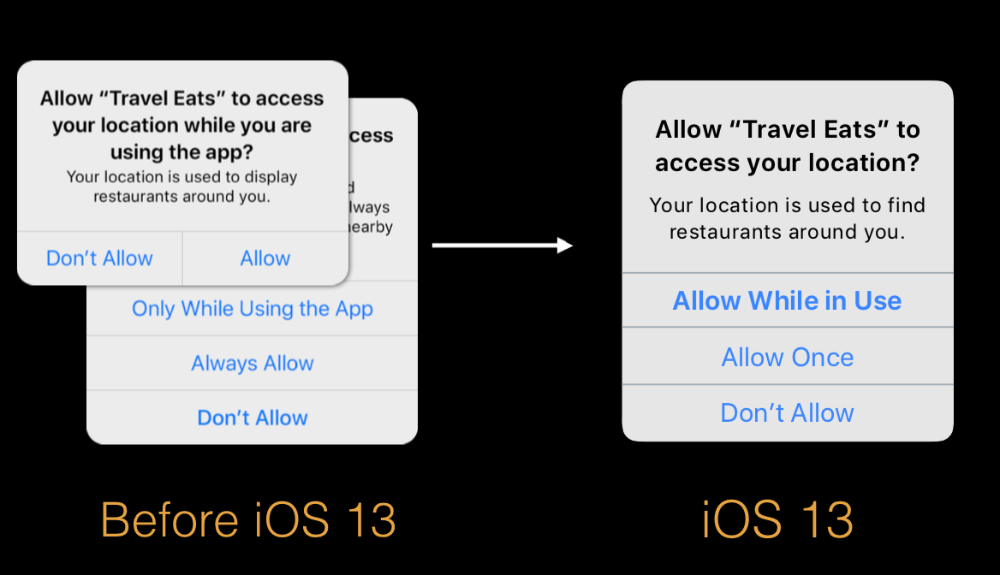
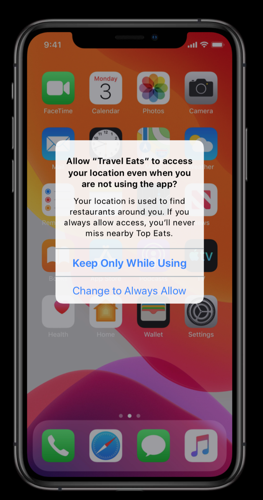
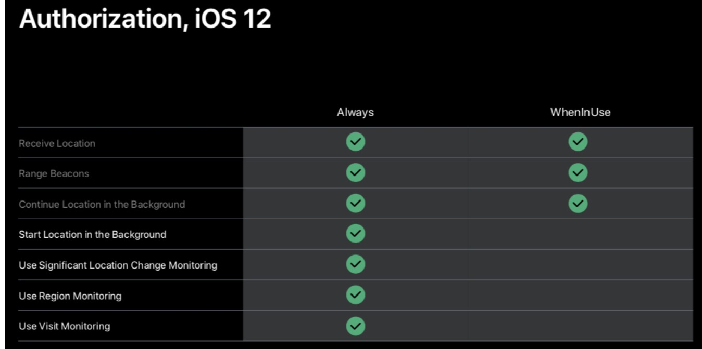
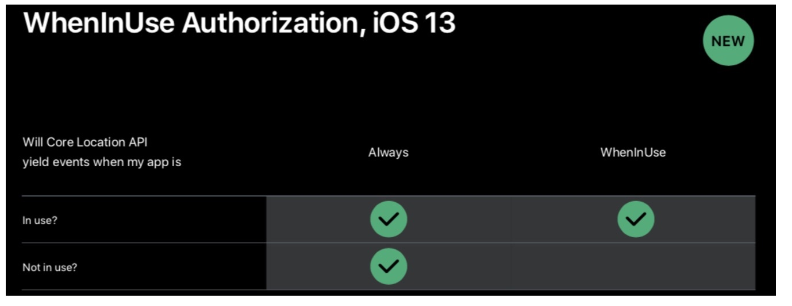
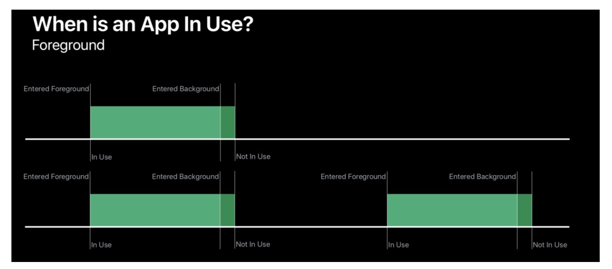
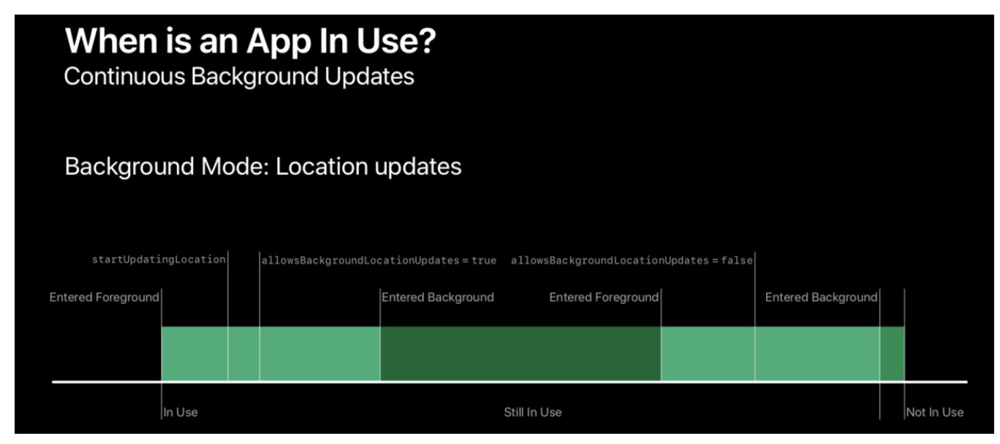

# 新增定位临时授权



若其他事件进入，比如接电话或者回复短信，应用就会退到后台，那么系统将会展示一个提示框给用户。



WhenInUse




在 iOS 13中，Always 不论 App 是否处于**使用**状态时，均可以使用 Core Location 的所有 API 。而 WhenInUse 只有在使用 App 时才可以使用 API

**使用状态**





```
CLLocationManager 有一个 allowsBackgroundLocationUpdates 的属性，默认值为 false 。将这个值设为 true 后，那么 App 进入后台之后可以继续更新定位。在进入后台和下一次进入前台的这段时间，App 依旧处于 In Use 状态。
```


> https://xiaozhuanlan.com/topic/4209567831
> https://developer.apple.com/videos/play/wwdc2019/705/