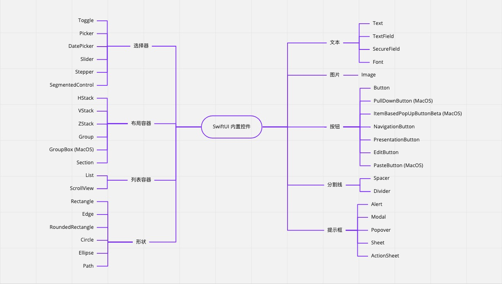
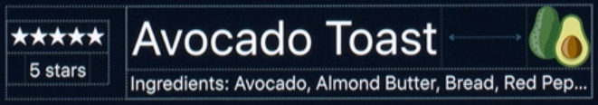

# SwiftUI 概览
## 内置控件


## 布局
### Stacks


HStack ：横向
VStack ：纵向
```
import SwiftUI

struct ContentView : View {
    var body: some View {
        HStack {
            VStack {
                Text("★★★★★")
                Text("5 stars")
                }.font(.caption)
            VStack {
                HStack {
                    Text("Avocado Toast").font(.title)
                    Spacer()
                    Image("20x20_avocado")
                }
                Text("Ingredients: Avocado, Almond Butter, Bread, Red Pepper Flakes")
                    .font(.caption).lineLimit(1)
            }
        }
    }
}
```

Stack 容器之间会有默认边距
文本的底边和底边之间会有间距
文本底部和控件边缘也会有边距

### 优先布局
```
HStack {
    Text("Delicious")
    Image("20x20_avocado")
    Text("Avocado Toast").layoutPriority(1)
}.frame(width: 200)
```

### 对齐方式
```
HStack(.center) {

    ...

}
```

```
.top
.center
.bottom
.firstTextBaseline
.lastTextBaseline
```

```
.leading
.center
.trailing
```

### 自定义对齐
通过扩展 VerticalAlignment 或者 HorizontalAlignment 来
```
extension VerticalAlignment {
    private enum MidStarAndTitle: AlignmentID {
        static func defaultValue(in context: ViewDimensions) -> Length {
            return context[.bottom]
        }
    }
    static let midStarAndTitle = VerticalAlignment(MidStarAndTitle.self)
}

struct ContentView : View {
    var body: some View {
        HStack {
            VStack {
                Text("★★★★★").alignmentGuide(.midStarAndTitle) { d in d[.bottom] / 2 } // 设置 MidStarAndTitle 的对齐方式
                Text("5 stars")
                }.font(.caption)
            VStack {
                HStack {
                    Text("Avocado Toast").font(.title)
                        .alignmentGuide(.midStarAndTitle) { d in d[.bottom] / 2 } // 设置 MidStarAndTitle 的对齐方式
                    Spacer()
                    Image("20x20_avocado")
                }
                Text("Ingredients: Avocado, Almond Butter, Bread, Red Pepper Flakes")
                    .font(.caption).lineLimit(1)
            }
        }
    }
}

```


OC extension 使用不广泛 
>https://tech.meituan.com/2015/03/03/diveintocategory.html


>https://xiaozhuanlan.com/topic/9586134027