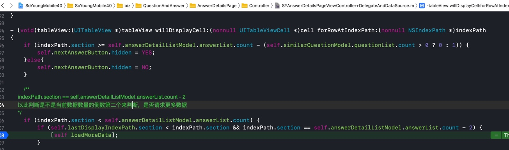

# 答案详情
可以滑下一个答案 ，不可以滑上一个答案。
触发下一个答案的条件是 触发加载更多方法 loadMoreData


页面架构是 TableView 嵌套TableView
## 页面 SYAnswerDetailsPageViewController
这个类外面只有两个cell
```
1、SYAnswerDetailTableViewCell
2、SYDAnswerDetailSimilarQuestionCell
```
### SYDAnswerDetailSimilarQuestionCell
