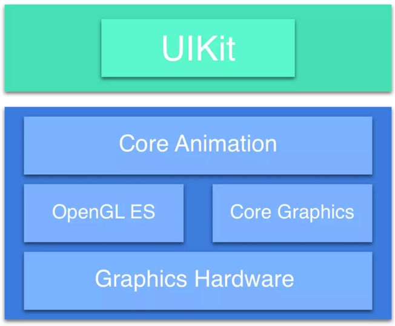
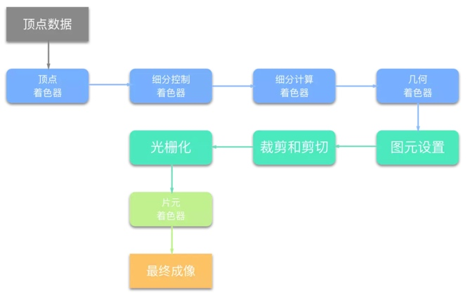
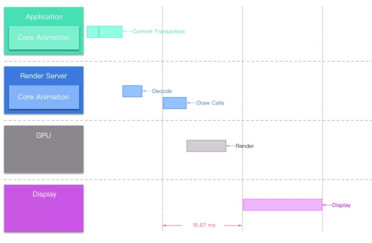

# 控件的渲染过程

#UIKit
UIKit Framwork 自身并不具备在屏幕成像的能力，他主要负责对用户操作事件的响应，事件响应的传递大体是经过逐层的**视图树**遍历实现的。

#Core Animation
Core Animation 本质上可以理解为是一个复合引擎，旨在尽可能的组合屏幕上不同的显示内容，这些显示内容被分解成独立的图层，即CALayer，CALayer才是你所能在屏幕上看见的一切基础。UIKit中需要在屏幕呈现的组件内部都有一个对应的CALayer，也就是所谓的Backing Layer。正式因为一一对应，所以CALayer也是树形结构的，我们称之为**图层数**。

视图的职责就是创建并管理这个图层，以确保当子视图在层级关系中添加或者被移除的时候，他们关联的图层也同样对应在层级关系树当中有相同的操作。

#OpenGL ES
历史上应用最广泛的3D图形API

## Core Graphics
Core Graphics Framework 基于 Quartz 高级绘图引擎。它提供了具有无与伦比的输出保真度的低级别轻量级 2D 渲染。您可以使用此框架来处理基于路径的绘图，转换，颜色管理，离屏渲染，图案，渐变和阴影，图像数据管理，图像创建和图像遮罩以及 PDF 文档创建，显示和分析。

## OpenGL ES
OpenGL ES 专为智能手机，平板电脑，视频游戏和PDA等嵌入式系统而设计。OpenGL ES 是历史上应用最广泛的3D图形API。

## Graphics Hardware 
图形硬件，CPU。

# OpenGL 主要渲染步骤

OpenGL 可以直接访问GPU,以实现硬件加速渲染。
一个用来渲染图形的OpenGL 程序主要可以大致分为以下几个步骤:

* 设置图元数据
* 着色器-shader 计算图元数据(位置·颜色·其他)
* 光栅化-rasterization 渲染为像素
* fragment shader ，决定最终成像
* 其他操作(显示·隐藏·融合)

日常开发时使用UIKit 布局视图控件，设置透明度等等都是属于**设置图元数据**这步，这也是我们日常开发中影响OpenGL 渲染的主要步骤。

## OpenGL Render Pipeline

Render Pipeline 实在是一个初次见面不太容易理解的词，它译为**渲染管道**
其实Render Pipeline 指的是**从应用程序数据转换到最终渲染的图像之间的一系列数据处理过程**。

这些图元数据流入 OpenGL 中，传入顶点着色器（vetex shader），然后顶点着色器对其进行着色器内部的处理后流出。之后可能进入细分着色阶段（tessellation shading stage），其中又有可能分为细分控制着色器和细分赋值着色器两部分处理，还可能会进入几何着色阶段（geometry shading stage），数据从中传递。最后都会走片元着色阶段（fragment shading stage）。

OpenGL 在最终成像之前还会经历一个阶段名为 **计算着色阶段**，这个阶段OpenGL会计算最重要在屏幕中成像的像素位置以及颜色，如果在之前提交代码时用到了 CALayer 会引起 blending 的显示效果（例如 Shadow）或者视图颜色或内容图片的 alpha 通道开启，都将会加大这个阶段 OpenGL 的工作量。

## Core Animation Pipeline(管道)

上文说到了 iOS 设备之所以可以成像不是因为 UIKit 而是因为 LayerKit，即 Core Animation。
Core Animation 图层，即 CALayer 中包含一个属性 contents，我们可以通过给这个属性赋值来控制 CALayer 成像的内容。这个属性的类型定义为 id，在程序编译时不论我们给 contents 赋予任何类型的值，都是可以编译通过的。但实践中，如果 contents 赋值类型不是 CGImage，那么你将会得到一个空白图层。

* 在 Application 中布局 UIKit 视图控件间接的关联 Core Animation 图层
* Core Animation 图层相关的数据提交到 iOS Render Server，即 OpenGL ES & Core Graphics
* Render Server 将与 GPU 通信把数据经过处理之后传递给 GPU
* GPU 调用 iOS 当前设备渲染相关的图形设备 Display

可以看到从 Commit Transaction 之后我们的图元数据就将会在下一次 RunLoop 时被 Application 发送给底层的 Render Server，底层 Render Server 直接面向 GPU 经过一些列的数据处理将处理完毕的数据传递给 GPU，然后 GPU 负责渲染工作，根据当前 iOS 设备的屏幕计算图像像素位置以及 **像素 alpha 通道混色计算**等等最终在当前 iOS 设备的显示屏中呈现图像。

## Commit Transaction

Core Animation Pipeline 的整个管线中 iOS 常规开发一般可以影响到的范围也就仅仅是在 Application 中布局 UIKit 视图控件间接的关联 Core Animation 图层这一级，即 Commit Transaction 之前的一些操作。
那么在 Commit Transaction 之前我们一般要做的事情有哪些？

* Layout，构建视图
* Display，绘制视图
* Prepare，额外的 Core Animation 工作
* Commit，打包图层并将它们发送到 Render Server

### Layout
在 Layout 阶段我们能做的是把 constraint 写的尽量高效，iOS 的 Layout Constraint 类似于 Android 的 Relative Layout。

这个阶段的 Layout 计算工作是在 CPU 完成的，包括 layoutSubviews 方法的重载，addSubview: 方法填充子视图等。

### Display

其实这里的 Display 仅仅是我们设置 iOS 设备要最终成像的图元数据而已，重载视图 drawRect: 方法可以自定义 UIView 的显示，其原理是在 drawRect: 方法内部绘制 bitmap。

> http://www.chuquan.me/2018/09/25/ios-graphics-render-principle/
> https://juejin.im/post/5ad3f1cc6fb9a028d9379c5f
> https://cloud.tencent.com/developer/article/1030703

