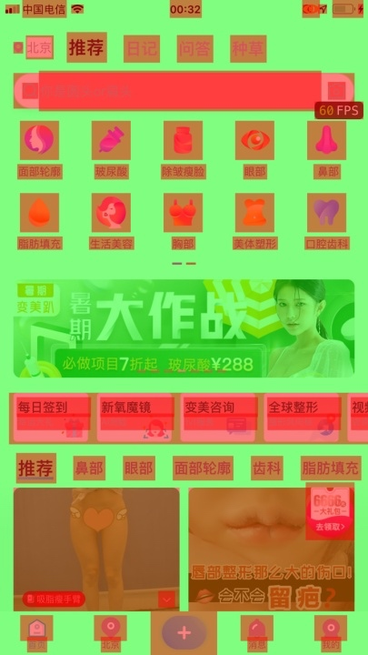

# 渲染一
## 关键词
* Color Blended Layers  颜色混合层 **越红表示性能越差，图片为红色，代表缩放或者拉伸**
* Color Hits Green and Misses Red 图层缓存 **红色越多，性能越差**
* Color Copied Images 图片格式检测 **蓝色越多，性能越差**
* Color Layer Formats 颜色层格式 
* Color Immediately 图片尺寸是否匹配 ***设置每帧都更新，会影响到渲染性能不要一直都设置**
* Color Misaligned Images 图片尺寸是否匹配 **被缩放为黄色，像素不对齐是紫色，黄色、紫色越多，性能越差**
* Color Offscreen-Rendered Yellow  圆角图层蒙版阴影重绘 **黄色越多，性能越差**
* Color Compositing Fast-Path Blue 快速路径 **蓝色越多，性能越好**
* Flash Updated Regions 重绘区域 **黄色越多，性能越差**

## 优化 
### 图层混合 Color Blended Layers 减少红色 
### 造成的原因：
我们要明白像素的概念。屏幕上每一个点都是一个像素点，颜色由R、G、B、alpha组成。如果某一块区域上覆盖了多层layer，最后所计算出来的显示的颜色效果，会受到这些layer的共同影响。（上层是蓝色(RGB=0,0,1),透明度为50%，下层是红色(RGB=1,0,0)。那么最终的显示效果是紫色(RGB=0.5,0,0.5)。
这种颜色的混合(blended)需要消耗一定的GPU资源，在实际开发中可能不止只有两层。如果只想显示最上层的颜色，可以把它的透明度设置为100%，这样GPU会忽略下面所有的layer，从而节约了很多不必要的运算）

这个选项如果勾选，你能看到哪个layer是透明的，GPU正在做混合计算。显示红色的就是透明的，绿色就是不透明的

### 解决方案
控件
* 控件尽量设置控件的backgroundColor属性与父视图的背景色一样 (Label 中文还是有),尽量不要直接使用clear背景色，因为还是会图层颜色混合.

在iOS8及其以上版本：UILabel的底图层变成了_UILabelLayer，绘制文本也有所改变我们可以通过打印日志可以看到这个_UILabelLayer。
那么如何解决呢？

我们仔细地看一看那个UILabel变红区域，我们发现文字并不是紧紧地靠着边界，而是与边界有一定的距离，其实这是超出了显示的内容的范围，从而引起了像素混合。(nameLabel.layer.masksToBounds = YES)

图片优化 红色的就是透明的
UIImageView控件比较特殊，不仅需要自身这个容器是不透明的，并且imageView包含的内容图片也必须是不透明的，如果你自己的图片出现了图层混合红色，先检查是不是自己的代码有问题，如果确认代码没问题，就是图片自身的问题

### 离屏渲染：Color Offscreen-Rendered Yellow，Color Hits Green and Misses Red (红色和黄色 性能差)
* 为图层设置遮罩（layer.mask）
* 将图层的layer.masksToBounds / view.clipsToBounds属性设置为true
* 将图层layer.allowsGroupOpacity属性设置为YES和layer.opacity小于1.0
* 为图层设置阴影（layer.shadow *）。
* 为图层设置layer.shouldRasterize=true
* 具有layer.cornerRadius，layer.edgeAntialiasingMask，layer.allowsEdgeAntialiasing的图层
* 文本（任何种类，包括UILabel，CATextLayer，Core Text等）。
* 使用CGContext在drawRect :方法中绘制大部分情况下会导致离屏渲染，甚至仅仅是一个空的实现。

### 优化
* 圆角优化 (推荐2)
1. 使用贝塞尔曲线UIBezierPath和Core Graphics框架画出一个圆角
2. 使用CAShapeLayer和UIBezierPath设置圆角

* shadow优化
1. 对于shadow，如果图层是个简单的几何图形或者圆角图形，我们可以通过设置shadowPath来优化性能，能大幅提高性能

### 像素不对齐:Color Misaligned Images
被缩放为黄色，像素不对齐是紫色，黄色、紫色越多，性能越差
frame像素不对齐  浮点

图片大小
图片像素不对齐

download下来的图片，可以在加载完后进行size处理，以满足imageView frame
https://www.jianshu.com/p/38cf9c170141

 
 > https://juejin.im/entry/58c75b061b69e6006bea6827

