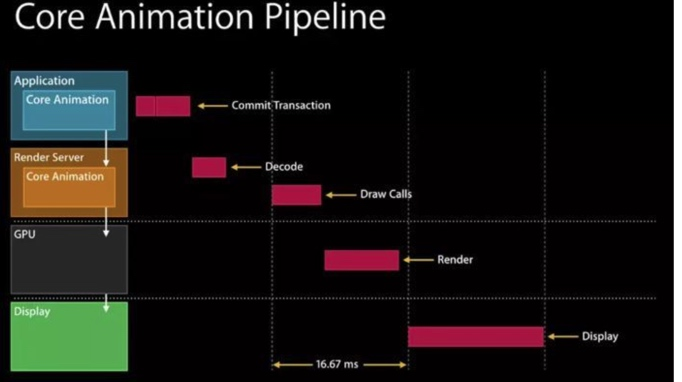
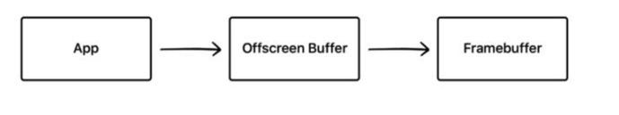
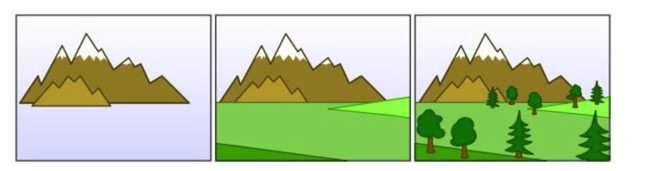
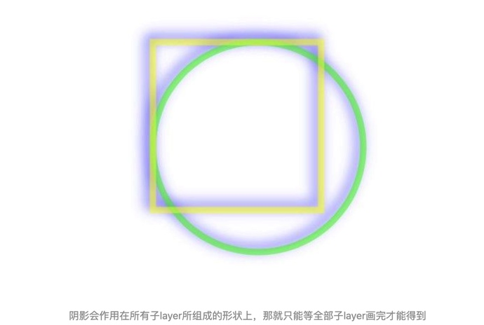

# 渲染二

我们可以看到，在Application这一层中主要是CPU在操作，而到了Render Server这一层，CoreAnimation会将具体操作转换成发送给GPU的draw calls（以前是call OpenGL ES，现在慢慢转到了Metal），显然CPU和GPU双方同处于一个流水线中，协作完成整个渲染工作。

## 离屏渲染

如果要在显示屏幕上显示内容，我们需要一块与屏幕像素数据量一样大的frame buffer，作为像素数据存储区域。如果有时面临一些限制，无法把渲染结果直接写入frame buffer，而是先暂存在另外的内存区域，之后再写入frame buffer，那么这个过程被称之为离屏渲染。

## GPU 离屏渲染
在上面的渲染流水线示意图中我们可以看到，主要的渲染操作都是由CoreAnimation的Render Server模块，通过调用显卡驱动所提供的OpenGL/Metal接口来执行的。通常对于每一层layer，Render Server会遵循“画家算法”，按次序输出到frame buffer，后一层覆盖前一层，就能得到最终的显示结果（值得一提的是，与一般桌面架构不同，在iOS中，设备主存和GPU的显存共享物理内存，这样可以省去一些数据传输开销

然而有些场景并没有那么简单。作为“画家”的GPU虽然可以一层一层往画布上进行输出，但是无法在某一层渲染完成之后，再回过头来擦除/改变其中的某个部分——因为在这一层之前的若干层layer像素数据，已经在渲染中被永久覆盖了。这就意味着，对于每一层layer，要么能找到一种通过单次遍历就能完成渲染的算法，要么就不得不另开一块内存，借助这个临时中转区域来完成一些更复杂的、多次的修改/剪裁操作。

## shadow
其原因在于，虽然layer本身是一块矩形区域，但是阴影默认是作用在其中”非透明区域“的，而且需要显示在所有layer内容的下方，因此根据画家算法必须被渲染在先。但矛盾在于此时阴影的本体（layer和其子layer）都还没有被组合到一起，怎么可能在第一步就画出只有完成最后一步之后才能知道的形状呢？这样一来又只能另外申请一块内存，把本体内容都先画好，再根据渲染结果的形状，添加阴影到frame buffer，最后把内容画上去（这只是我的猜测，实际情况可能更复杂）。不过如果我们能够预先告诉CoreAnimation（通过shadowPath属性）阴影的几何形状，那么阴影当然可以先被独立渲染出来，不需要依赖layer本体，也就不再需要离屏渲染了。

## Color Blended Layers  颜色混合层
很多情况下，界面都是会出现多个UI控件叠加的情况，如果有透明或者半透明的控件，那么GPU会去计算这些这些layer最终的显示的颜色，也就是我们肉眼所看到的效果。例如一个上层Veiw颜色是绿色RGB(0,255,0)，下层又放了一个View颜色是红色RGB(0,0,255)，透明度是50%，那么最终显示到我们眼前的颜色是蓝色RGB(0,127.5,127.5)。这个计算过程会消耗一定的GPU资源损耗性能

## 像素不对齐:Color Misaligned Images

https://zhuanlan.zhihu.com/p/72653360