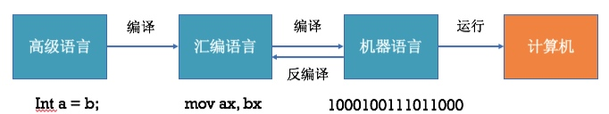

# # 001--初识汇编

我们在学习逆向开发之前,我们要了解一个基本的逆向原理.首先我们是逆向iOS系统上面的APP.那么我们知道,一个APP安装在手机上面的可执行文件本质上是二进制文件.因为iPhone手机本质上执行的指令是二进制.是由手机上的CPU执行的.所以逆向开发是建立在分析二进制上面.所以今天我们接下来的课程从非常基础的东西开始讲解.
## 汇编语言的发展
### 机器语言
> 由0和1组成的机器指令.

* 加：0100 0000
* 减：0100 1000
* 乘：1111 0111 1110 0000 
* 除：1111 0111 1111 0000 

### 汇编语言(assembly language)
> 使用助记符代替机器语言
> 如:

* 加：INC EAX		通过编译器 0100 0000
* 减：DEC EAX		通过编译器 0100 1000
* 乘：MUL EAX 		通过编译器 1111 0111 1110 0000
* 除：DIV EAX		通过编译器 1111 0111 1111 0000

###高级语言（High-level programming language)
>C\C++\Java\OC\Swift,更加接近人类的自然语言
>比如C语言:

* 加：A+B		通过编译器			0100 0000
* 减：A-B		通过编译器			0100 1000
* 乘：A*B 	通过编译器			1111 0111 1110 0000
* 除：A/B		通过编译器			1111 0111 1111 0000


我们的代码在终端设备上是这样的过程:




*  **汇编语言**与**机器语言**一一对应，每一条机器指令都有与之对应的汇编指令
*  **汇编语言**可以通过编译得到**机器语言**，**机器语言**可以通过反汇编得到**汇编语言**
*  **高级语言**可以通过编译得到**汇编语言** \ **机器语言**，但汇编语言\机器语言几乎不可能还原成**高级语言**

### 汇编语言的特点
* 可以直接访问、控制各种硬件设备，比如存储器、CPU等，能最大限度地发挥硬件的功能

* 能够不受编译器的限制，对生成的二进制代码进行完全的控制

* 目标代码简短，占用内存少，执行速度快

* 汇编指令是机器指令的助记符,同机器指令一一对应。每一种CPU都有自己的机器指令集\汇编指令集，所以汇编语言不具备可移植性
* 知识点过多，开发者需要对CPU等硬件结构有所了解，不易于编写、调试、维护

* 不区分大小写，比如mov和MOV是一样的

### 汇编的用途(哥么我学了能干啥?)
* 编写驱动程序、操作系统（比如Linux内核的某些关键部分）
* 对性能要求极高的程序或者代码片段，可与高级语言混合使用（内联汇编）
* 软件安全
  * 病毒分析与防治
  * 逆向\加壳\脱壳\破解\外挂\免杀\加密解密\漏洞\黑客
* 理解整个计算机系统的最佳起点和最有效途径
* 为编写高效代码打下基础
* 弄清代码的本质
  * 函数的本质究竟是什么?
  * ++a + ++a + ++a 底层如何执行的?
  * 编译器到底帮我们干了什么?
  * DEBUG模式和RELEASE模式有什么关键的地方被我们忽略
  * ......

最后来句装13的话
> 越底层越单纯!真正的程序员都需要了解的一门非常重要的语言,汇编!

### 汇编语言的种类
* 目前讨论比较多的汇编语言有
  * 8086汇编（8086处理器是16bit的CPU）
  * Win32汇编
  * Win64汇编
  * ARM汇编（嵌入式、Mac、iOS）
  * ......

* 我们iPhone里面用到的是ARM汇编,但是不同的设备也有差异.因CPU的架构不同.

架构 | 设备 
----|------
armv6 | iPhone, iPhone2, iPhone3G, 第一代、第二代 iPod Touch
armv7 | iPhone3GS, iPhone4, iPhone4S,iPad, iPad2, iPad3(The New iPad), iPad mini, iPod Touch 3G, iPod Touch4
armv7s |iPhone5, iPhone5C, iPad4(iPad with Retina Display)
arm64 | iPhone5S 以后 iPhoneX , iPad Air, iPad mini2以后


### 几个必要的常识
* 要想学好汇编,首先需要了解CPU等硬件结构
* APP/程序的执行过程


* 硬件相关最为重要是CPU/内存
* 在汇编中,大部分指令都是和CPU与内存相关的


### 总线


* 每一个CPU芯片都有许多管脚，这些管脚和总线相连，CPU通过总线跟外部器件进行交互
* 总线：一根根导线的集合
* 总线的分类
  * 地址总线
  * 数据总线
  * 控制总线


**举个例子**


* **地址总线**
  * 它的宽度决定了CPU的_寻址能力_
  * 8086的地址总线宽度是_20_，所以寻址能力是_1M_（ 2^20  ）


* **数据总线**
  * 它的宽度决定了CPU的单次数据传送量，也就是数据_传送速度_
  * 8086的数据总线宽度是_16_，所以单次最大传递_2个字节_的数据
* **控制总线**
  * 它的宽度决定了CPU对其他器件的_控制能力_、能有多少种控制


**做个小练习**
* 一个CPU 的寻址能力为8KB,那么它的地址总线的宽度为\_\_\_\_
* 8080,8088,80286,80386 的**地址总线**宽度分别为16根,20根,24根,32根.那么他们的寻址能力分别为多少\_\_\_\_KB, \_\_\_\_MB,\_\_\_\_MB,\_\_\_\_GB?
* 8080,8088,8086,80286,80386 的**数据总线**宽度分别为8根,8根,16根,16根,32根.那么它们一次可以传输的数据为:\_\_\_\_B,\_\_\_\_B,\_\_\_\_B,\_\_\_\_B,\_\_\_\_B,
* 从内存中读取1024字节的数据,8086至少要读\_\_\_\_次,80386至少要读取\_\_\_\_次.


**答案**


### 内存


* 内存地址空间的大小受CPU地址总线宽度的限制。8086的地址总线宽度为20，可以定位2^20个不同的内存单元（内存地址范围0x00000~0xFFFFF），所以8086的内存空间大小为1MB

* 0x00000~0x9FFFF：主存储器。可读可写

* 0xA0000~0xBFFFF：向显存中写入数据，这些数据会被显卡输出到显示器。可读可写

* 0xC0000~0xFFFFF：存储各种硬件\系统信息。只读


##进制
**学习进制的障碍**
>很多人学不好进制，原因是总以十进制为依托去考虑其他进制，需要运算的时候也总是先转换成十进制，这种学习方法是错误的.
>我们为什么一定要转换十进制呢？仅仅是因为我们对十进制最熟悉，所以才转换.
>每一种进制都是完美的,想学好进制首先要忘掉十进制，也要忘掉进制间的转换！

###进制的定义
* 八进制由8个符号组成:0 1 2 3 4 5 6 7 逢八进一
* 十进制由10个符号组成:0 1 2 3 4 5 6 7 8 9逢十进一
* N进制就是由N个符号组成:逢N进一


#####做个练习
* 1 + 1 在____情况下等于 3 ?

```思考
.
.
.
.
.
.
.
.
.
.
.
.
.
```

> 十进制由10个符号组成: 0 1 3 2 8 A B E S 7 逢十进一

如果这样定义十进制: 1 + 1 = 3!就对了!

**这样的目的何在?**
传统我们定义的十进制和自定义的十进制不一样.那么这10个符号如果我们不告诉别人这个符号表,别人是没办法拿到我们的具体数据的!用于加密!

>**十进制**由十个**符号**组成,逢十进一,**符号**是可以**自定义**的!!

###进制的运算

#####做个练习
* 八进制运算
	* 2 + 3 = __ , 2 * 3 = __ ,4 + 5 = __ ,4 * 5 = __.
	* 277 + 333 = __ , 276 * 54 = __ , 237 - 54 = __ , 234 / 4 = __ .
	
	

	

#####八进制加法表
```
 0  1  2  3  4  5  6  7 
10 11 12 13 14 15 16 17
20 21 22 23 24 25 26 27
...

1+1 = 2						
1+2 = 3   2+2 = 4				
1+3 = 4   2+3 = 5   3+3 = 6
1+4 = 5   2+4 = 6   3+4 = 7   4+4 = 10  
1+5 = 6   2+5 = 7   3+5 = 10  4+5 = 11  5+5 = 12
1+6 = 7   2+6 = 10  3+6 = 11  4+6 = 12  5+6 = 13  6+6 = 14
1+7 = 10  2+7 = 11  3+7 = 12  4+7 = 13  5+7 = 14  6+7 = 15  7+7 = 16
```

#####八进制乘法表
```
0 1 2 3 4 5 6 7 10 11 12 13 14 15 16 17 20 21 22 23 24 25 26 27...
1*1 = 1						
1*2 = 2	  2*2 = 4				
1*3 = 3	  2*3 = 6	3*3 = 11	
1*4 = 4	  2*4 = 10	3*4 = 14  4*4 = 20
1*5 = 5	  2*5 = 12	3*5 = 17  4*5 = 24  5*5 = 31
1*6 = 6	  2*6 = 14	3*6 = 22  4*6 = 30  5*6 = 36  6*6 = 44
1*7 = 7	  2*7 = 16	3*7 = 25  4*7 = 34  5*7 = 43  6*7 = 52  7*7 = 61
```
#####实战四则运算
```
   277         236         276         234
+  333       -  54       *  54       /   4
--------    --------    --------    --------    
```


###二进制的简写形式
```
       二进制: 1 0 1 1 1 0 1 1 1 1 0 0
三个二进制一组: 101 110 111 100
       八进制:   5   6   7   4
四个二进制一组: 1011 1011 1100
     十六进制:    b    b    c
```
>二进制：从0 写到 1111
>0000 0001 0010 0011 0100 0101 0110 0111 1000 1001 1010 1011 1100 1101 1110 1111 
>这种二进制使用起来太麻烦，改成更简单一点的符号：
>0 1 2 3 4 5 6 7 8 9 A B C D E F 这就是十六进制了


###数据的宽度
数学上的数字，是没有大小限制的，可以无限的大。但在计算机中，由于受硬件的制约，数据都是有长度限制的（我们称为数据宽度），超过最多宽度的数据会被丢弃。

``` objc
#import <UIKit/UIKit.h>
#import "AppDelegate.h"

int test(){
    int cTemp = 0x1FFFFFFFF;
    return cTemp;
}

int main(int argc, char * argv[]) {
    printf("%x\n",test());
    @autoreleasepool {
        return UIApplicationMain(argc, argv, nil, NSStringFromClass([AppDelegate class]));
    }
}
```

###计算机中常见的数据宽度

* 位(Bit): 1个位就是1个二进制位.0或者1
* 字节(Byte): 1个字节由8个Bit组成(8位).内存中的最小单元Byte.
* 字(Word): 1个字由2个字节组成(16位),这2个字节分别称为高字节和低字节.
* 双字(Doubleword): 1个双字由两个字组成(32位)

那么计算机存储数据它会分为有符号数和无符号数.那么关于这个看图就理解了!


```
无符号数,直接换算!
有符号数:
正数:  0    1    2    3    4    5    6    7 
负数:  F    E    D    B    C    A    9    8
      -1   -2   -3   -4   -5   -6   -7   -8
```
###自定义进制符号
#####练习
* 现在有10进制数 10个符号分别是：2，9，1，7，6，5，4， 8，3 , A 逢10进1 那么： 123 + 234 = ____

```

十进制:    0  1  2  3  4  5  6  7  8  9
自定义:    2  9  1  7  6  5  4  8  3  A
         92 99 91 97 96 95 94 98 93 9A
         12 19 11 17 16 15 14 18 13 1A
         72 79 71 77 76 75 74 78 73 7A
         62 69 61 67 66 65 64 68 63 6A
         52 59 51 57 56 55 54 58 53 5A
         42 49 41 47 46 45 44 48 43 4A
         82 89 81 87 86 85 84 88 83 8A
         32 39 31 37 36 35 34 38 33 3A
         922
```


那么刚才通过10进制运算可以转化10进制然后查表!但是如果是其他进制.我们就不能转换,要直接学会查表

* 现在有9进制数 9个符号分别是：2，9，1，7，6，5，4， 8，3 逢9进1 那么： 123 + 234 = ____

```

十进制:    0  1  2  3  4  5  6  7  8  
自定义:    2  9  1  7  6  5  4  8  3  
         92 99 91 97 96 95 94 98 93 
         12 19 11 17 16 15 14 18 13 
         72 79 71 77 76 75 74 78 73 
         62 69 61 67 66 65 64 68 63 
         52 59 51 57 56 55 54 58 53 
         42 49 41 47 46 45 44 48 43 
         82 89 81 87 86 85 84 88 83 
         32 39 31 37 36 35 34 38 33 
         922
```


### 寄存器
**内部部件之间由总线连接**


* 对程序员来说，CPU中最主要部件是寄存器，可以通过改变寄存器的内容来实现对CPU的控制
* 不同的CPU，寄存器的个数、结构是不相同的


### 通用寄存器
* ARM64拥有有31个64位的通用寄存器 x0 到 x30,这些寄存器通常用来存放一般性的数据，称为通用寄存器（有时也有特定用途）
	* 那么w0 到 w28 这些是32位的. 因为64位CPU可以兼容32位.所以可以只使用64位寄存器的低32位.
	* 比如 w0 就是 x0的低32位!
	
	
* 通常，CPU会先将内存中的数据存储到通用寄存器中，然后再对通用寄存器中的数据进行运算
* 假设内存中有块红色内存空间的值是3，现在想把它的值加1，并将结果存储到蓝色内存空间


  * CPU首先会将红色内存空间的值放到X0寄存器中：mov X0,红色内存空间
  * 然后让X0寄存器与1相加：add X0,1
  * 最后将值赋值给内存空间：mov 蓝色内存空间,X0
  
###pc寄存器(program counter)

* 为指令指针寄存器，它指示了CPU当前要读取指令的地址
* 在内存或者磁盘上，指令和数据没有任何区别，都是二进制信息
* CPU在工作的时候把有的信息看做指令，有的信息看做数据，为同样的信息赋予了不同的意义
	* 比如 1110 0000 0000 0011 0000 1000 1010 1010 
	* 可以当做数据   0xE003008AA 
	* 也可以当做指令  mov    x0, x8
* CPU根据什么将内存中的信息看做指令？
  * CPU将pc指向的内存单元的内容看做指令
  * 如果内存中的某段内容曾被CPU执行过，那么它所在的内存单元必然被pc指向过


### bl指令

* CPU从何处执行指令是由pc中的内容决定的，我们可以通过改变pc的内容来控制CPU执行目标指令
* ARM64提供了一个mov指令（传送指令），可以用来修改大部分寄存器的值，比如
  * mov x0,#10、mov x1,#20
* 但是，mov指令不能用于设置pc的值，ARM64没有提供这样的功能

* ARM64提供了另外的指令来修改PC的值，这些指令统称为转移指令，最简单的是bl指令


### bl指令 -- 练习
现在有两段代码!假设程序先执行A,请写出指令执行顺序.最终寄存器x0的值是多少?

```
_A:
    mov x0,#0xa0
    mov x1,#0x00
    add x1, x0, #0x14
    mov x0,x1
    bl _B
    mov x0,#0x0
    ret

_B:
    add x0, x0, #0x10
    ret
```

	

