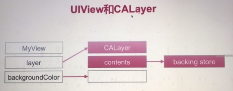
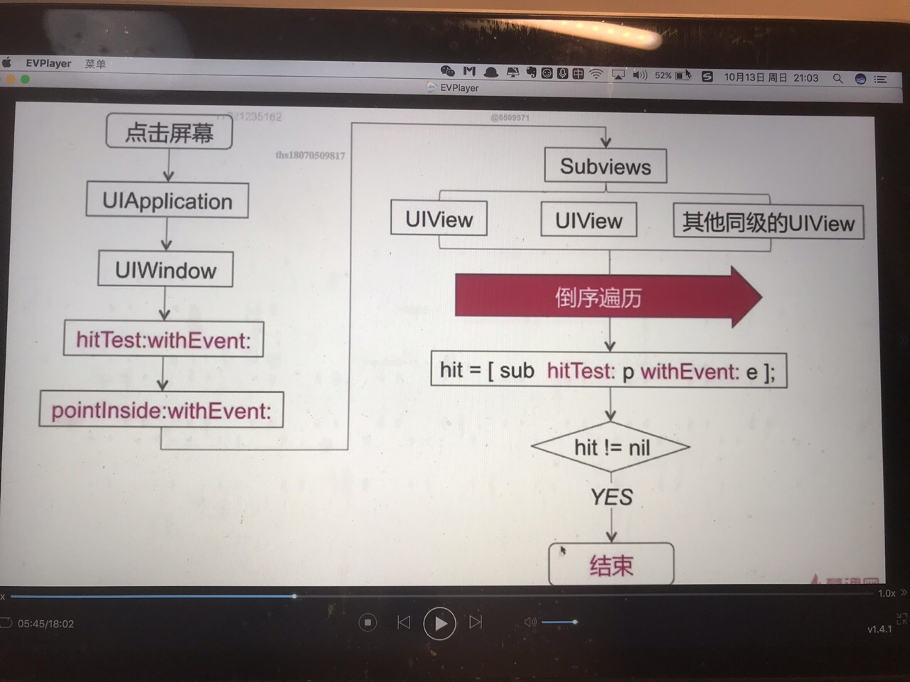
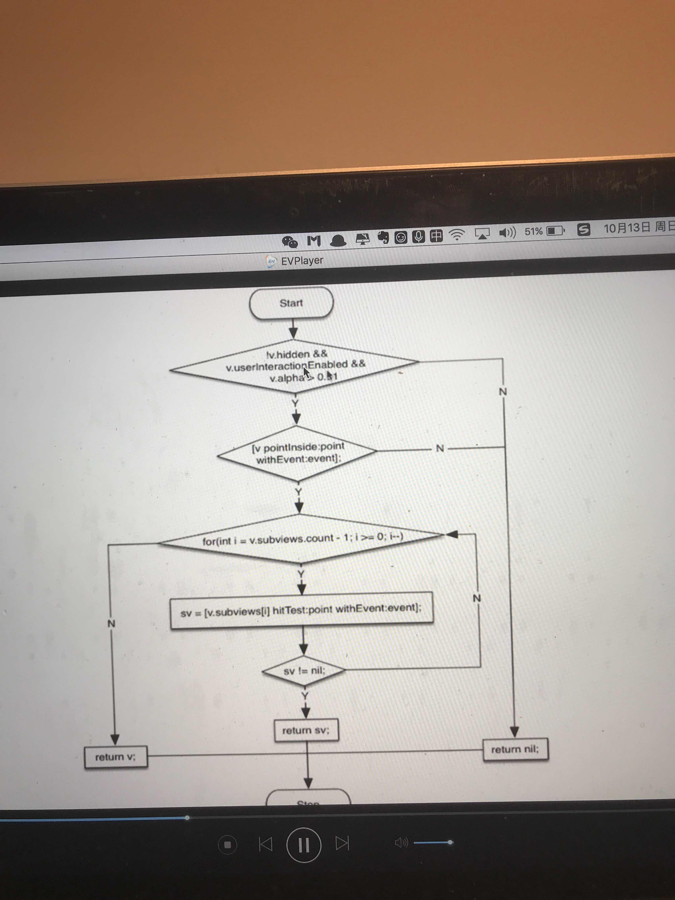
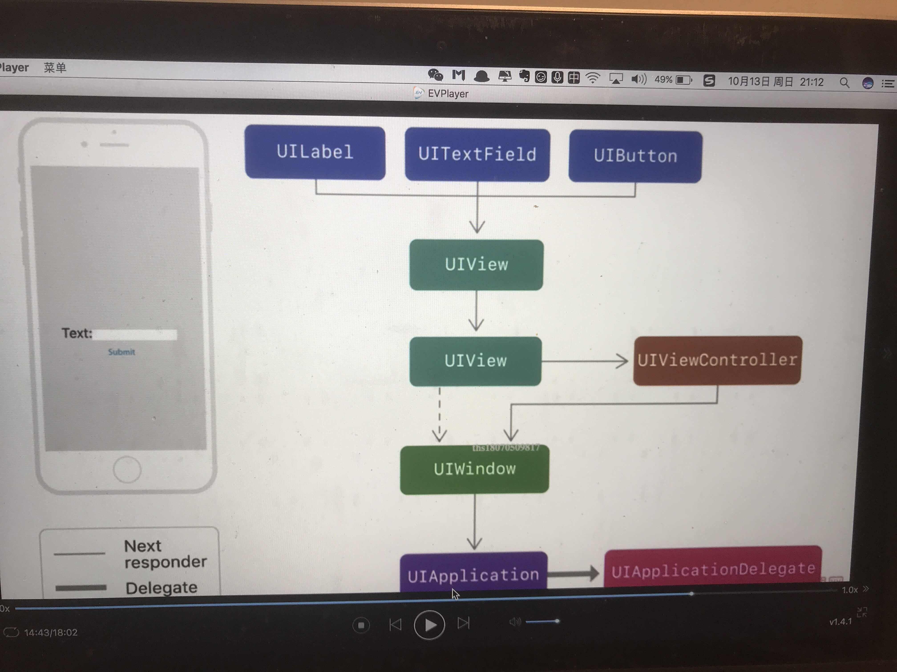

# UI事件传递和响应
## UIView 和CALayer



* UIView 为其提供内容，以及负责处理触摸等事件，参与响应链。
* CALayer 负责显示内容contents。
分开的原因是单一原则。

### 事件传递
```
- (UIView*)hitTest:withEvent:
- (void)pointInside:withEvent:
```
- (UIView *)hitTest:withEvent: 采用倒序遍历 方法



- (UIView *)hitTest:withEvent: 系统实现

```
首先三个条件：不是透明alpha、可以交互、没有隐藏hidden
然后判断这个点是否在自己身上，如果在就遍历自己的子视图。


如果你想把点击事件指定某个控件上，可以在父控件上指定
- (UIView *)hitTest:withEvent:

```

### 事件响应


父控件可以响应就传给父控件，如果没有父控件，就给UIViewController


视图事件响应方法
```
- (void)touchsBegan:(NSSet *)touches withEvent:(UIEvent *)event;
- (void)touchsMoved:(NSSet *)touches withEvent:(UIEvent *)event;
- (void)touchsEnded:(NSSet *)touches withEvent:(UIEvent *)event;
```

