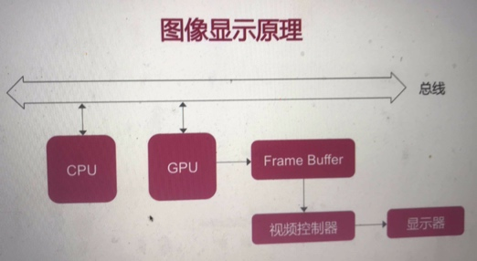
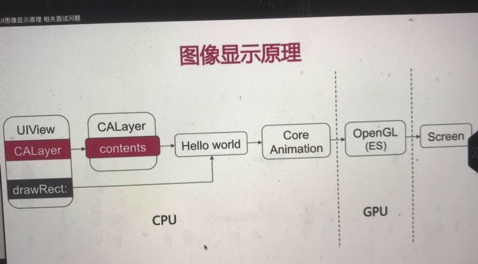

# UI图像显示原理
CPU 和GPU 是通过总线连接的。




# CPU 工作
```
Layout -> Display -> Prepare -> Commit

UI布局      绘制     图片编解码    提交位图
文本计算
```

# GPU渲染管线
```
顶点着色 图片装配 光栅化 片段着色  片段处理

           ||
           FrameBuffer 帧缓存区
```