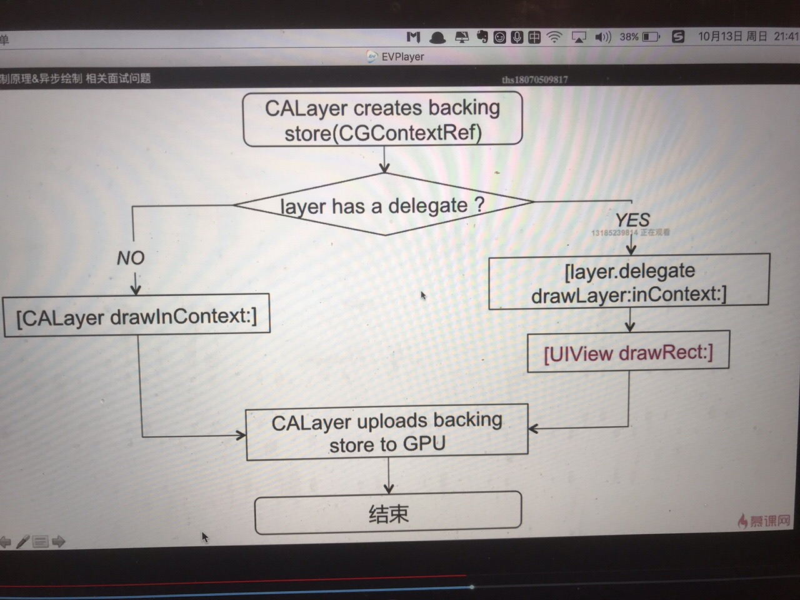
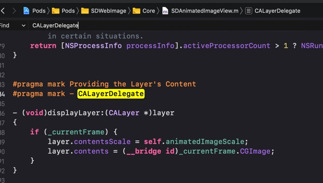
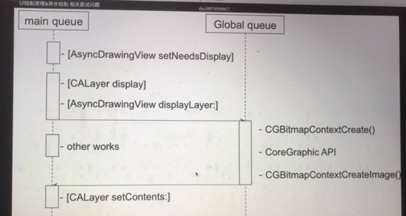

# UI绘制原因&异步绘制
```
[UIView setNeedsDisplay]
          |
[view.layer setNeedsDisplay]      
          |
[CALayer display] 在当前runLooper 结束的时候渲染控件
          |
[layer.delegate respondsTo @selector(displayLayer:)] 
      YES               NO
   异步绘制入口      系统绘制流程   
             结束
```


## 异步绘制
* 代理负责生成对应的bitmap
* 设置bitmap作为layer.contents 属性的值



如果没有实现 CALayerDelegate 就会实现下面那个方法
```
- (void)drawLayer:(CALayer *)layer inContext:(CGContextRef)ctx

```

