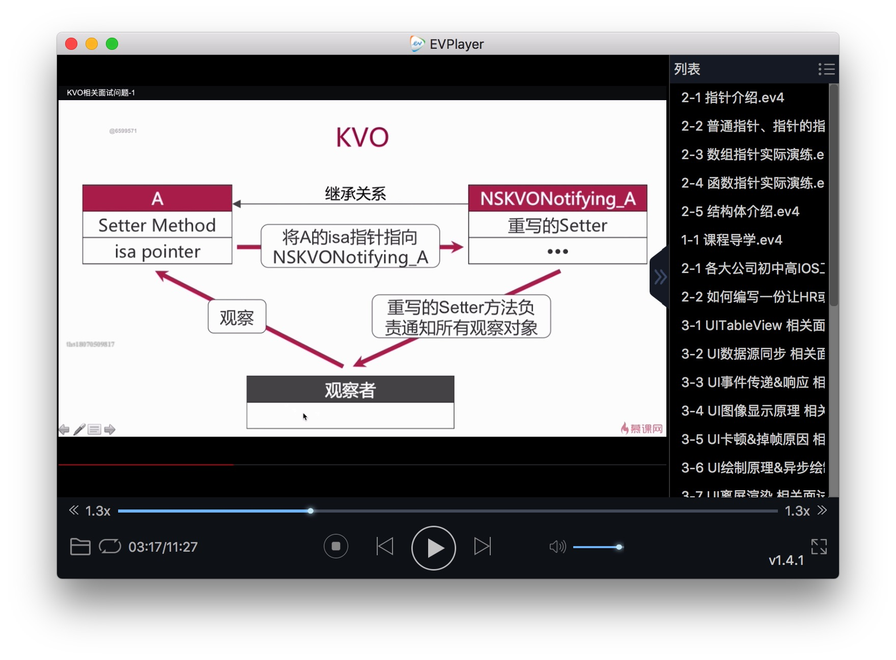
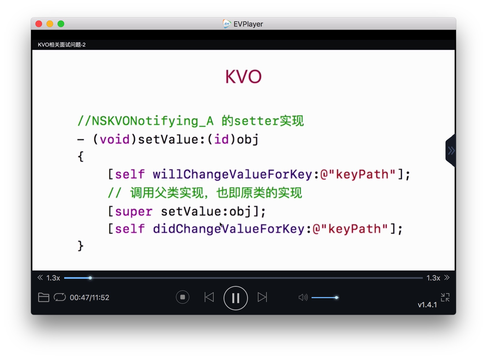
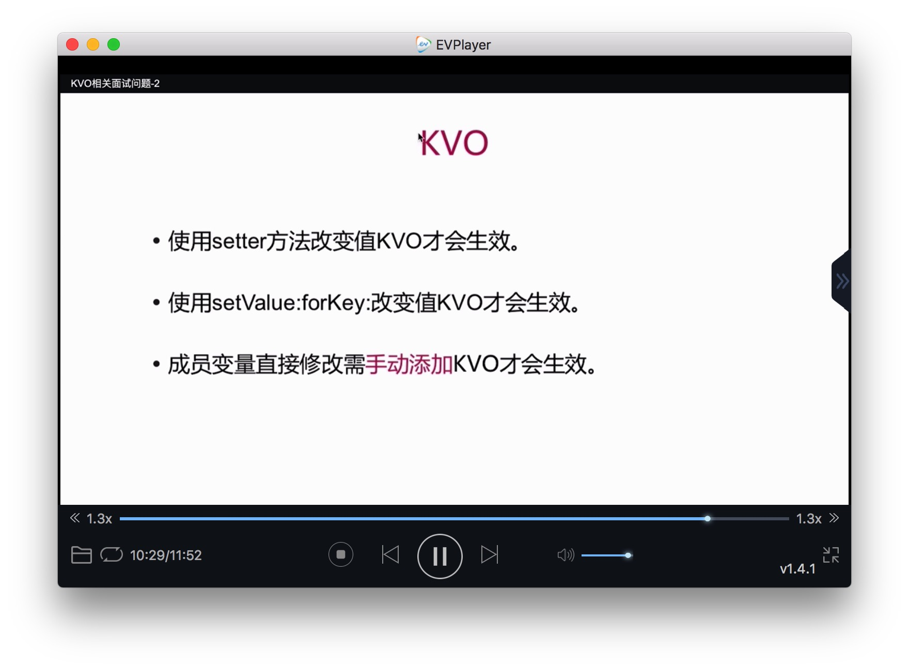
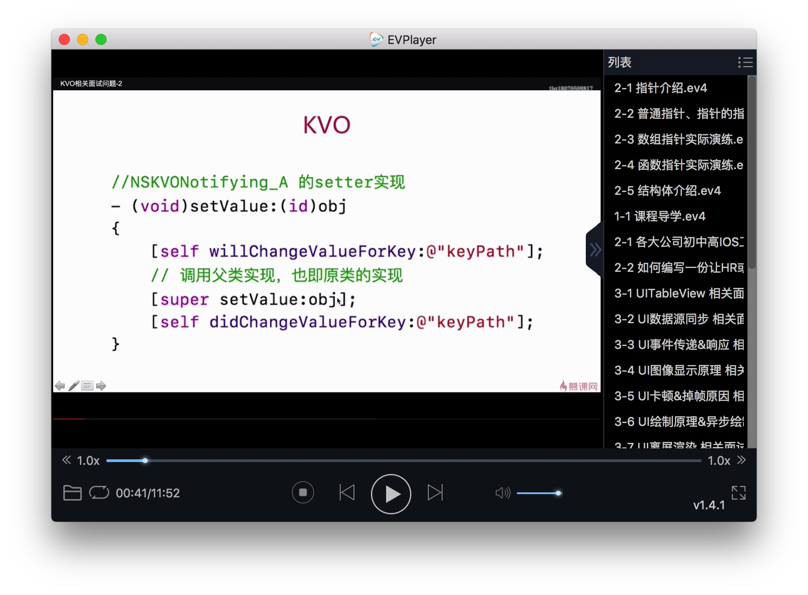
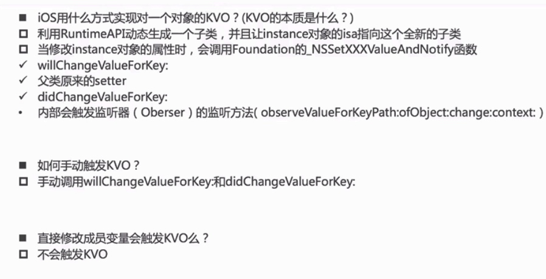

# KVO
* KVO 是Object-C对**观察者设计模式**的又一实现。
* Apple 使用了isa混写（**isa-swizzling**）来实现KVO 

# KVO 实现

* 通过KVC设置value，KVO能否生效。

 能生效，会执行setValue方法，

* 通过成员变量直接赋值value，KVO能否生效。
 
 不能生效，需要手动设置 willChangeValueForKey: 方法和
 didChangeValueForKey: 方法。

