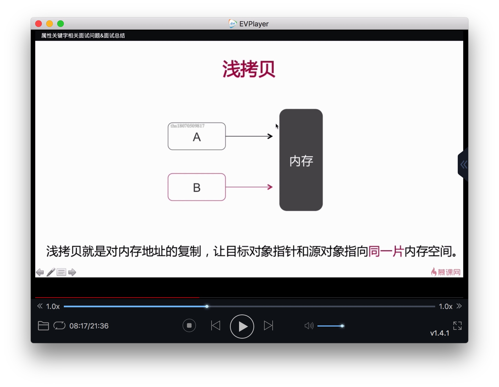
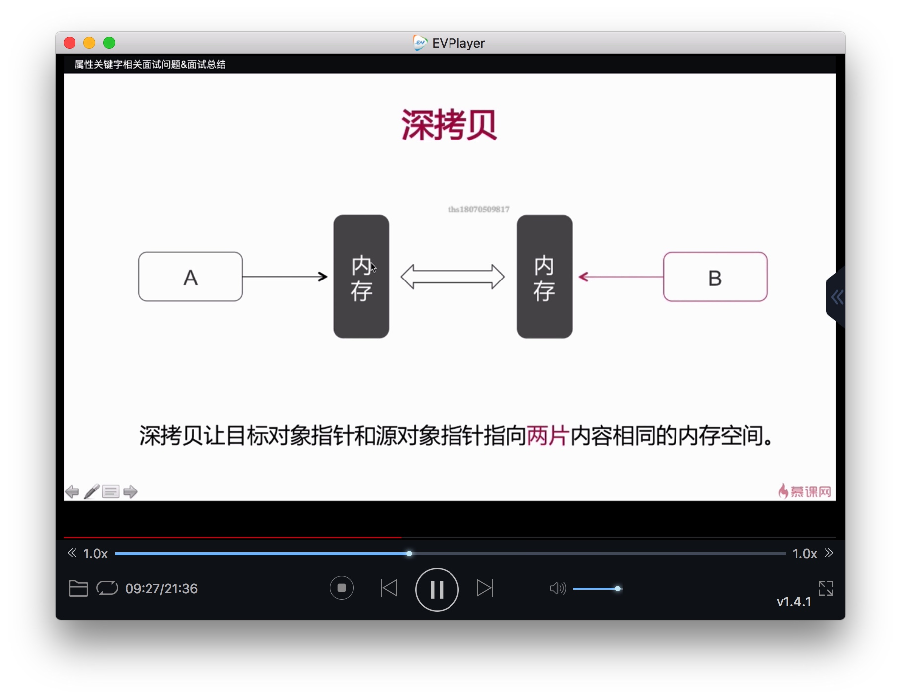
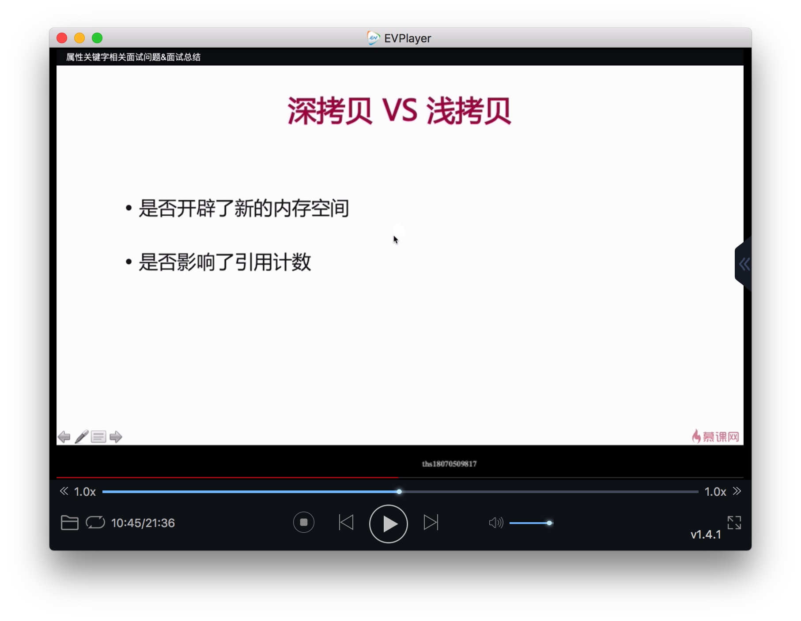
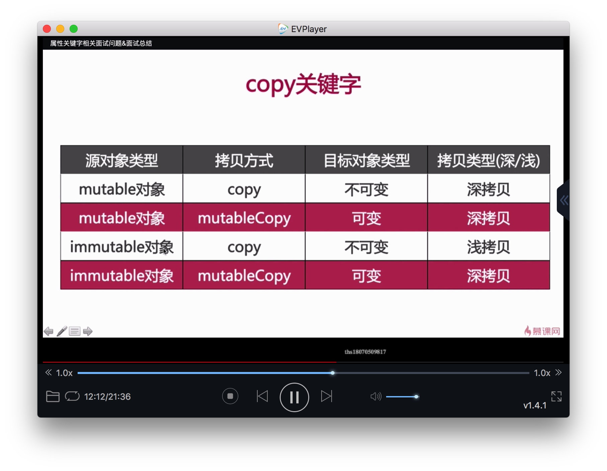
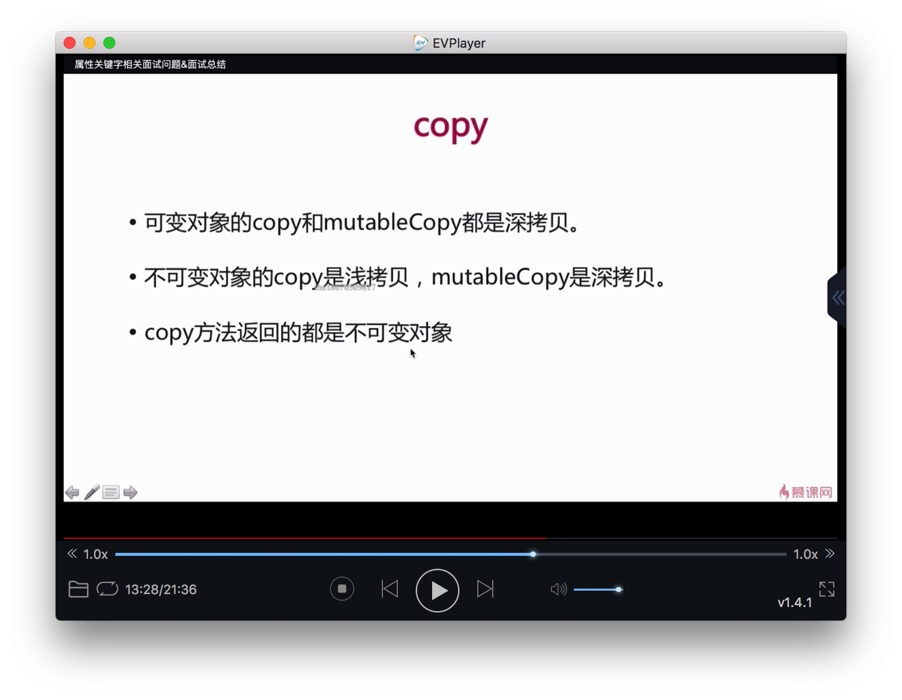
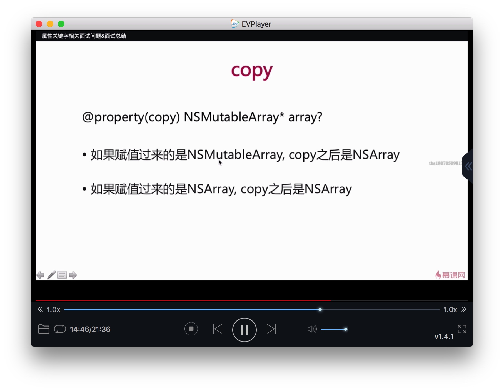
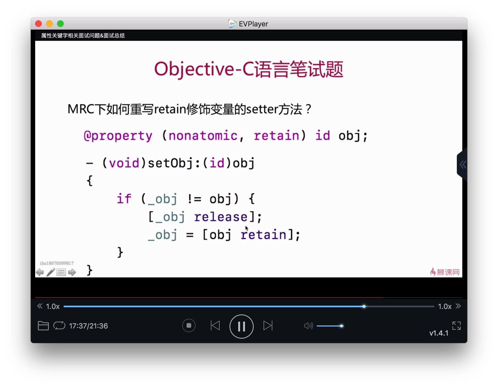
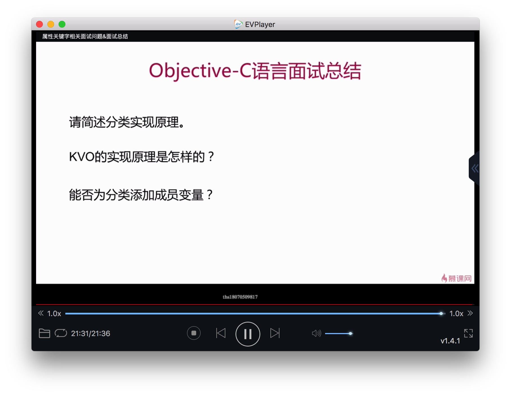

# 属性关键字

原子性
* atomic
* nonatomic

引用计数
* retain/strong
* assign
* weak
* copy

# assign 、weak 、copy
## assign
* assign 修饰基本数据类型，如int,BOOL等
* assign 修饰对象类型时，不改变其引用计数
* assign 修改的对象释放时，对象还可以访问，会产生悬垂指针(野指针)。

## weak 
* 不改变被修饰对象的引用计数。
* 所指向对象在被释放之后会自动置为nil。
* 不可以修饰基本数据类型。

## copy
### 浅拷贝

第一个是深拷贝，第二个是浅拷贝，都是生成不可变数组。

